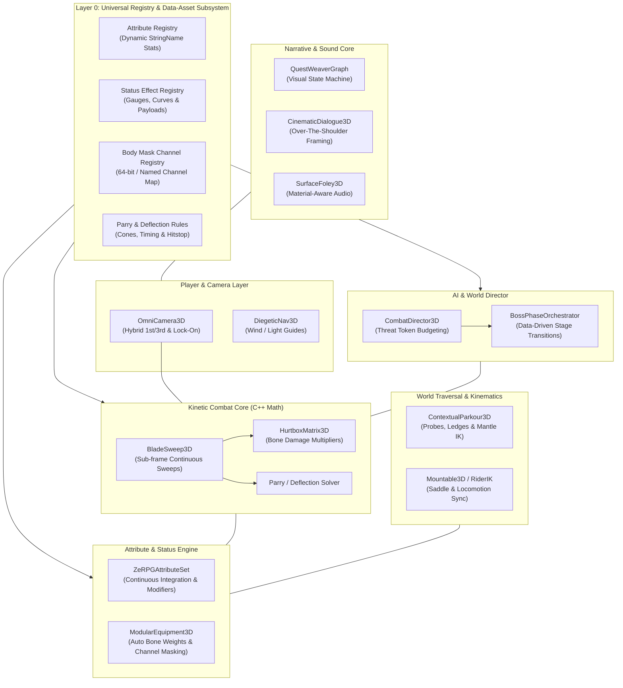
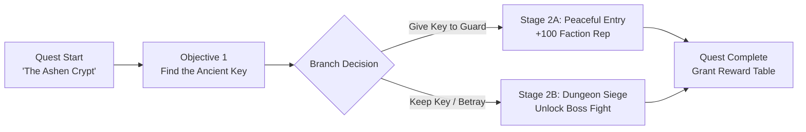

# Advanced RPG System (ARPGS) — Master Implementation Specification

Welcome to the comprehensive architectural specification and implementation plan for the **Advanced RPG System (ARPGS)** in **ZeGFX Engine**.

This document outlines the technical blueprint to establish ZeGFX as the definitive, industry-leading engine for **3rd-Person and 1st-Person Action/Adventure RPGs** (encompassing genres from *Elden Ring, God of War, and Monster Hunter* to *Cyberpunk 2077, Ghost of Tsushima, Devil May Cry, and The Witcher 3*).

---

## Architectural Philosophy: C++ Math Engine vs. Data-Driven Rules

> **Core Principle: "C++ Owns the Math; Data Assets & Zelyn Own the Content."**  
> ARPGS is **NOT** a rigid Souls-like clone generator with hardcoded stats or fixed 6-element enums. Hardcoding 7 stats, 6 elements, or an 8-bit armor mask in C++ headers locks developers into one narrow genre forever.
>
> In ZeGFX ARPGS:
> 1. **C++ Core (Engine Runtime)**: Provides high-speed, zero-allocation mathematical solvers, continuous sub-frame sweep interpolation, gauge accumulation & decay integration, threat token queuing, trajectory IK warping, and spatial memory pooling.
> 2. **Layer 0 Data Registry (Data-Assets & Zelyn)**: Every attribute, status effect, damage type, body mask channel, and parry rule is registered dynamically by `StringName` ID from data files.
> 3. **Opt-In Preset Layer**: Souls-like mechanics, Character-Action/DMC mechanics, Cyberpunk/Sci-Fi FP mechanics, and Monster Hunter hunting mechanics are shipped as **pluggable data presets** (`presets/souls_like/`, `presets/hack_and_slash/`, `presets/first_person_arpg/`, etc.) alongside a clean `presets/template_blank/`.

---

## Table of Contents

1. [Executive Overview & System Architecture](#1-executive-overview--system-architecture)
2. [Layer 0: Universal Registry & Data-Asset Architecture](#2-layer-0-universal-registry--data-asset-architecture)
3. [Pillar 1: OmniCamera3D (Hybrid 1st/3rd Person & Lock-On Director)](#3-pillar-1-omnicamera3d-hybrid-1st3rd-person--lock-on-director)
4. [Pillar 2: BladeSweep3D (Kinetic Hit Detection & Parry Matrix)](#4-pillar-2-bladesweep3d-kinetic-hit-detection--parry-matrix)
5. [Pillar 3: ZeRPG Attribute, Poise & Status Gauge Engine](#5-pillar-3-zerpg-attribute-poise--status-gauge-engine)
6. [Pillar 4: CombatDirector3D & AI Threat Slot Orchestration](#6-pillar-4-combatdirector3d--ai-threat-slot-orchestration)
7. [Pillar 5: Contextual Parkour, Traversal & Mount Engine](#7-pillar-5-contextual-parkour-traversal--mount-engine)
8. [Pillar 6: Modular Equipment & Dynamic Channel-Masking Pipeline](#8-pillar-6-modular-equipment--dynamic-channel-masking-pipeline)
9. [Pillar 7: QuestWeaver & Cinematic Dialogue Studio](#9-pillar-7-questweaver--cinematic-dialogue-studio)
10. [Pillar 8: Diegetic Navigation & Surface Foley Pipeline](#10-pillar-8-diegetic-navigation--surface-foley-pipeline)
11. [In-Editor Combat Sandbox & Tuning Workbench](#11-in-editor-combat-sandbox--tuning-workbench)
12. [Pluggable Genre Presets & Starting Templates](#12-pluggable-genre-presets--starting-templates)
13. [Master Implementation Roadmap & File Topology](#13-master-implementation-roadmap--file-topology)

---

## 1. Executive Overview & System Architecture



---

## 2. Layer 0: Universal Registry & Data-Asset Architecture

To ensure ZeGFX never hardcodes game-specific assumptions into C++ headers, **Layer 0** provides a centralized, data-driven registration architecture.

### 2.1 Attribute Definition Data Asset (`AttributeDefinition`)
Attributes are not fixed C++ enum slots (`STAT_VIGOR`, `STAT_STRENGTH`). They are data-defined resources loaded from disk or Zelyn definitions.

```cpp
class AttributeDefinition : public Resource {
    GDCLASS(AttributeDefinition, Resource);

public:
    enum ClampingBehavior {
        CLAMP_MIN_ONLY,
        CLAMP_MIN_MAX,
        NO_CLAMP
    };

    StringName attribute_id;          // e.g. "health", "stamina", "cyberware_capacity", "mana"
    String display_name;              // e.g. "Health Points", "Cyberware Load"
    float base_value = 100.0f;
    float min_value = 0.0f;
    float max_value = 100.0f;
    ClampingBehavior clamping = CLAMP_MIN_MAX;
    bool is_consumed = false;         // True for depletable pools (HP, Mana, Stamina)
    StringName max_attribute_link;    // If consumed, links to max pool (e.g. "max_health")
    Ref<Curve> scaling_curve;         // Level scaling or diminishing returns curve
};
```

### 2.2 Status Effect & Gauge Definition (`StatusEffectDefinition`)
Continuous status meters (Bleed, Frost, Shock, or Cyber-Overheat, Radiation, Toxicity) are defined entirely through data assets.

```cpp
class StatusEffectDefinition : public Resource {
    GDCLASS(StatusEffectDefinition, Resource);

public:
    enum TriggerBehavior {
        TRIGGER_INSTANT_BURST,     // e.g. Bleed (instant % damage)
        TRIGGER_LINGERING_DOT,     // e.g. Poison/Burn (ticking damage over time)
        TRIGGER_STATE_LOCK,        // e.g. Frostbite/Stun (stagger, slow, debuff)
        TRIGGER_CUSTOM_SCRIPT      // Executes custom GameplayEffect / Zelyn script
    };

    StringName effect_id;             // e.g. "bleed", "frost", "cyber_overheat", "rot"
    String display_name;
    float max_threshold = 100.0f;     // Gauge capacity to trigger burst
    float decay_rate = 5.0f;          // Points decayed per second
    float decay_delay = 3.0f;         // Delay in seconds before decay begins
    TriggerBehavior trigger_behavior = TRIGGER_INSTANT_BURST;
    float duration_on_trigger = 10.0f;

    // Trigger Payloads
    Ref<GameplayEffect> on_trigger_effect;
    Ref<Material> active_material_overlay; // Visual shader profile applied to character
    Ref<PackedScene> trigger_vfx;          // Particle burst spawned on trigger
    StringName trigger_audio_event;        // Sound bus event
};
```

### 2.3 Body Mask Channel Registry (`BodyMaskRegistry`)
Rather than a rigid 8-bit mask (`MASK_HEAD`, `MASK_TORSO`), ZeGFX supports **64 arbitrary named channels** configured in Project Settings or Data Assets.

```cpp
class BodyMaskRegistry : public Object {
    GDCLASS(BodyMaskRegistry, Object);

private:
    static inline HashMap<StringName, uint64_t> channel_name_to_bit;
    static inline HashMap<uint64_t, StringName> bit_to_channel_name;

public:
    static void register_channel(const StringName &p_name, int p_channel_index);
    static uint64_t get_channel_bit(const StringName &p_name);
    static uint64_t compile_mask(const TypedArray<StringName> &p_channel_names);
};
```

*Example Registered Channels:*
- **Fantasy Rig**: `"head"`, `"torso"`, `"left_pauldron"`, `"right_pauldron"`, `"gauntlets"`, `"greaves"`, `"boots"`, `"cape"`.
- **Sci-Fi / Mecha Rig**: `"chassis"`, `"cockpit"`, `"left_servo_arm"`, `"right_servo_arm"`, `"left_booster"`, `"optics_sensor"`.
- **Creature Rig**: `"torso"`, `"wings"`, `"tail_upper"`, `"tail_lower"`, `"horns"`.

---

## 3. Pillar 1: OmniCamera3D (Hybrid 1st/3rd Person & Lock-On Director)

### 3.1 Technical Objective
Deliver a unified, jitter-free camera controller that smoothly transitions between First-Person and Third-Person perspectives, handles Soft and Hard target lock-on, compensates for giant boss elevation, and prevents geometry clipping using predictive sphere casting with dithering.

### 3.2 C++ Class Architecture & Header Definition
**File**: `scene/3d/omni_camera_3d.h` / `scene/3d/omni_camera_3d.cpp`

```cpp
class OmniCamera3D : public Node3D {
    GDCLASS(OmniCamera3D, Node3D);

public:
    enum PerspectiveMode {
        PERSPECTIVE_THIRD_PERSON,
        PERSPECTIVE_FIRST_PERSON,
        PERSPECTIVE_TRANSITIONING
    };

    enum LockOnMode {
        LOCK_ON_NONE,
        LOCK_ON_SOFT,     // Aim assistance & character rotation assist
        LOCK_ON_HARD      // Strict framing of target + player
    };

    struct CameraFramingProfile {
        Vector3 default_offset = Vector3(0.5f, 1.5f, 3.5f);
        Vector3 combat_offset = Vector3(0.7f, 1.4f, 4.2f);
        Vector3 first_person_offset = Vector3(0.0f, 1.7f, 0.0f);
        float field_of_view = 75.0f;
        float arm_length = 3.5f;
        float collision_radius = 0.25f;
        float position_smoothing = 14.0f;
        float rotation_smoothing = 18.0f;
        float boss_elevation_bias = 0.35f;
    };

private:
    PerspectiveMode perspective_mode = PERSPECTIVE_THIRD_PERSON;
    LockOnMode lock_on_mode = LOCK_ON_NONE;
    CameraFramingProfile profile;

    Node3D *target_node = nullptr;
    Node3D *follow_target = nullptr;
    Camera3D *internal_camera = nullptr;
    SpringArm3D *spring_arm = nullptr;

    Vector3 current_velocity;
    Vector2 look_input;
    float current_arm_length = 3.5f;
    float transition_alpha = 0.0f;

    // First Person Dynamics
    float bob_timer = 0.0f;
    Vector3 sway_offset;

public:
    void set_perspective_mode(PerspectiveMode p_mode, float p_transition_time = 0.3f);
    void set_lock_on_target(Node3D *p_target, LockOnMode p_mode);
    void cycle_lock_on_target(int p_direction);
    void trigger_impulse_shake(const Ref<CameraShakeProfile> &p_profile, Vector3 p_direction);
    void update_camera_transform(float p_delta);

protected:
    static void _bind_methods();
    void _notification(int p_what);
};
```

---

## 4. Pillar 2: BladeSweep3D (Kinetic Hit Detection & Parry Matrix)

### 4.1 Technical Objective
Provide continuous, sub-frame weapon collision sweeps along socket-defined bones, dynamic hurtbox damage multipliers, and a directional parry/deflection solver that executes frame hit-stops and spark VFX.

```
       Frame N (Time T)                 Frame N+1 (Time T + Δt)
       [Socket_A0] ===== [Socket_B0]     [Socket_A1] ===== [Socket_B1]
           \              \                 /              /
            \              \               /              /
             \============== CONTINUOUS SWEEP =============/
             [Sub-step Capsule Hull interpolation K=4..8]
```

### 4.2 C++ Class Architecture & Header Definition
**File**: `modules/gameplay/collision/blade_sweep_3d.h` / `blade_sweep_3d.cpp`

```cpp
class BladeSweep3D : public Node3D {
    GDCLASS(BladeSweep3D, Node3D);

public:
    struct SweepSegment {
        StringName start_socket; // e.g. "hilt", "blade_mid", "tip"
        StringName end_socket;
        float capsule_radius = 0.08f;
        int sub_step_count = 4;
    };

    struct HitResult {
        Node3D *hit_target = nullptr;
        Vector3 hit_point;
        Vector3 hit_normal;
        StringName hit_bone_name;
        StringName damage_type;
        float final_damage = 0.0f;
        float poise_damage = 0.0f;
        bool was_parried = false;
    };

private:
    Skeleton3D *skeleton = nullptr;
    Vector<SweepSegment> segments;
    Vector<Transform3D> previous_transforms;
    bool is_active = false;
    uint32_t collision_mask = 1;

    // Configurable Parry Rule Reference
    Ref<ParryRuleDefinition> active_parry_rule;
    HashSet<ObjectID> victim_history;

public:
    void start_sweep(int p_start_frame, int p_end_frame);
    void stop_sweep();
    void set_active_parry_rule(const Ref<ParryRuleDefinition> &p_rule);
    bool check_parry_deflection(const Vector3 &p_incoming_attack_dir, Node3D *p_attacker);

    TypedArray<Dictionary> execute_subframe_sweep(float p_delta);

protected:
    static void _bind_methods();
};
```

---

## 5. Pillar 3: ZeRPG Attribute, Poise & Status Gauge Engine

### 5.1 Technical Objective
A fully data-driven RPG progression engine where C++ performs continuous numerical integration for gauges, stamina regen, and poise decay, while attribute types and status gauges are instantiated dynamically via `StringName` keys.

### 5.2 Mathematical Mechanics (C++ Math Engine)

#### 1. Continuous Status Gauge Integration & Decay
For any registered status gauge $G_i$ (e.g. `"bleed"`, `"cyber_overheat"`, `"toxic"`):

$$\frac{dG_i}{dt} = 
\begin{cases} 
- \text{DecayRate}_i & \text{if } t_{idle} > \text{DecayDelay}_i \text{ and } G_i > 0 \\ 
0 & \text{otherwise} 
\end{cases}$$

When $G_i \ge \text{MaxThreshold}_i$:
- $G_i$ resets to 0 (or retains threshold overflow).
- Dispatches the associated `GameplayEffect` payload.
- Attaches the `StatusVisualProfile` material overlay to the character.

#### 2. Poise Depletion & Hyper-Armor
When an incoming attack hits with poise damage $D_{poise}$:

$$P_{new} = 
\begin{cases} 
P_{current} - (D_{poise} \cdot (1.0 - H_{reduction})) & \text{if HyperArmor is Active} \\ 
P_{current} - D_{poise} & \text{otherwise} 
\end{cases}$$

If $P_{new} \le 0$:
- Broadcasts `poise_broken(attacker, stun_duration)`.
- Enters vulnerable critical/riposte state.

### 5.3 C++ Class Architecture & Header Definition
**File**: `modules/gameplay/attributes/zerpg_attribute_set.h` / `zerpg_attribute_set.cpp`

```cpp
class ZeRPGAttributeSet : public Resource {
    GDCLASS(ZeRPGAttributeSet, Resource);

public:
    struct AttributeValue {
        float base_value = 100.0f;
        float current_value = 100.0f;
        float flat_modifier = 0.0f;
        float percent_modifier = 1.0f;
    };

    struct ActiveStatusGauge {
        Ref<StatusEffectDefinition> definition;
        float current_buildup = 0.0f;
        float timer_since_hit = 0.0f;
        bool is_active = false;
        float active_duration = 0.0f;
    };

private:
    HashMap<StringName, AttributeValue> attributes;
    HashMap<StringName, ActiveStatusGauge> status_gauges;

    // Dynamic Poise Subsystem
    float current_poise = 100.0f;
    float max_poise = 100.0f;
    float poise_recovery_delay = 4.0f;
    float poise_recovery_timer = 0.0f;
    float hyper_armor_reduction = 0.0f; // 0.0 = No hyper-armor, 0.8 = 80% poise reduction
    bool is_hyper_armor_active = false;

public:
    void register_attribute(const Ref<AttributeDefinition> &p_def);
    void register_status_effect(const Ref<StatusEffectDefinition> &p_def);

    float get_attribute_value(const StringName &p_id) const;
    void modify_attribute(const StringName &p_id, float p_delta);
    void apply_damage(float p_raw_damage, float p_poise_damage, const StringName &p_damage_type, const Dictionary &p_elemental_buildups);

    void tick_attributes(float p_delta);
    void set_hyper_armor(bool p_active, float p_damage_reduction = 0.5f);

protected:
    static void _bind_methods();
};
```

---

## 6. Pillar 4: CombatDirector3D & AI Threat Slot Orchestration

### 6.1 Technical Objective
Coordinate multi-enemy group combat using a data-driven token budget, dynamic threat slots (melee, ranged, flanking), and multi-stage boss phase controllers.

```
                         [ CombatDirector3D ]
                       /          |          \
           (Melee Token)    (Ranged Token)    (Flank Queue)
                |                 |                 |
         [ Aggressor 1 ]    [ Archer 2 ]    [ Circling Minions 3, 4, 5 ]
         (Executes Combo)   (Aims Spell)    (Taunt, Reposition, Feint)
```

### 6.2 C++ Class Architecture & Header Definition
**File**: `modules/gameplay/ai/combat_director_3d.h` / `combat_director_3d.cpp`

```cpp
class CombatDirector3D : public Node3D {
    GDCLASS(CombatDirector3D, Node3D);

public:
    struct ThreatSlot {
        Node3D *assigned_enemy = nullptr;
        float slot_angle = 0.0f;
        float target_distance = 3.0f;
        bool is_attacking = false;
    };

    struct TokenPool {
        int max_tokens = 2;
        int active_tokens = 0;
    };

private:
    Node3D *player_target = nullptr;
    HashMap<StringName, TokenPool> token_pools; // e.g. "melee", "ranged", "heavy", "aerial"
    Vector<Node3D *> registered_enemies;
    Vector<ThreatSlot> circling_slots;

    // Boss Phase Integration
    bool is_boss_encounter = false;
    int current_boss_phase = 1;
    Ref<BossPhaseProfile> boss_profile;

public:
    void configure_token_pool(const StringName &p_category, int p_max_tokens);
    bool request_attack_token(Node3D *p_enemy, const StringName &p_category);
    void release_attack_token(Node3D *p_enemy, const StringName &p_category);
    
    void register_combatant(Node3D *p_enemy);
    void unregister_combatant(Node3D *p_enemy);
    Vector3 get_assigned_circling_position(Node3D *p_enemy);

protected:
    static void _bind_methods();
    void _process(double p_delta);
};
```

---

## 7. Pillar 5: Contextual Parkour, Traversal & Mount Engine

### 7.1 Technical Objective
Deliver zero-setup obstacle traversal (Step-Up, Low Vault, High Mantle, Ledge Grab) using procedural IK bone alignment, alongside a `Mountable3D` system for horses, vehicles, and creatures.

```
       [ Obstacle Surface Detected ]
                  │
     ┌────────────┴────────────┐
     ▼                         ▼
Height < 0.8m             Height < 1.8m             Height >= 1.8m
 [ Low Vault ]             [ High Mantle ]           [ Wall-Climb / Hang ]
 (Keep momentum)           (Pull body up)            (Enter Braced Hang IK)
```

### 7.2 C++ Class Architecture & Header Definition
**File**: `scene/3d/contextual_parkour_3d.h` / `contextual_parkour_3d.cpp`

```cpp
class ContextualParkour3D : public Node3D {
    GDCLASS(ContextualParkour3D, Node3D);

public:
    enum TraversalAction {
        TRAVERSAL_NONE,
        TRAVERSAL_STEP_UP,
        TRAVERSAL_VAULT_LOW,
        TRAVERSAL_MANTLE_HIGH,
        TRAVERSAL_LEDGE_GRAB,
        TRAVERSAL_SLOPE_SLIDE
    };

    struct LedgeDetectionResult {
        bool has_ledge = false;
        Vector3 wall_normal;
        Vector3 ledge_top_point;
        Vector3 left_hand_ik_target;
        Vector3 right_hand_ik_target;
        float obstacle_height = 0.0f;
        float obstacle_depth = 0.0f;
    };

private:
    CharacterBody3D *character = nullptr;
    Skeleton3D *skeleton = nullptr;
    TwoBoneIK3D *left_arm_ik = nullptr;
    TwoBoneIK3D *right_arm_ik = nullptr;

    float max_climb_height = 2.5f;
    float max_vault_depth = 1.2f;

public:
    LedgeDetectionResult probe_environment_ahead(const Transform3D &p_character_transform, const Vector3 &p_move_input);
    void execute_traversal(const LedgeDetectionResult &p_ledge, TraversalAction p_action);

protected:
    static void _bind_methods();
};
```

---

## 8. Pillar 6: Modular Equipment & Dynamic Channel-Masking Pipeline

### 8.1 Technical Objective
Equip layered modular armor sets across arbitrary named channels with automated bone weight sharing on the base `Skeleton3D` and body polygon masking to eliminate 100% of mesh clipping.

```
[ Base Character Skeleton3D ]
       ▲                ▲                 ▲
       │                │                 │
[ Head Rig ]    [ Torso Armor ]   [ Plate Boots ]
(Weight Share)  (Masks "torso")   (Masks "calves")
```

### 8.2 Dynamic Channel Masking Mechanism
An armor item defines which body channels it conceals via a list of `StringName` channels:

```cpp
class ModularArmorPiece : public Resource {
    GDCLASS(ModularArmorPiece, Resource);

public:
    StringName slot_id;                       // e.g. "chest", "head", "wings", "cyber_arm"
    Ref<Mesh> armor_mesh;
    TypedArray<StringName> masked_channels;   // e.g. ["torso", "upper_arms", "neck"]
    Dictionary stat_modifiers;                // e.g. { "defense": 45.0, "poise": 15.0 }
};
```

When equipped on `ModularEquipment3D`:
1. The armor mesh instance binds directly to the player's existing `Skeleton3D` pointer (zero duplicate skinning costs).
2. The player base mesh driver compiles the bitmask from `BodyMaskRegistry::compile_mask()` and applies a vertex-discard shader mask, hiding the suppressed body geometry beneath the armor.

---

## 9. Pillar 7: QuestWeaver & Cinematic Dialogue Studio

### 9.1 Technical Objective
A visual, node-based quest state machine with branching decisions and persistent save serialization, paired with an automated over-the-shoulder dialogue staging camera with real-time depth-of-field focus pulling.



### 9.2 Dialogue Staging & Lip-Sync Driver
- **Automated Framing**: Automatically calculates optimal over-the-shoulder Camera A (looking at NPC) and Camera B (looking at Player) based on character eye sockets.
- **Physical Bokeh DoF**: Automatically drives `CameraAttributesPhysical::dof_blur_far_distance` to isolate the speaking character against a softly blurred background.
- **Voice-to-Blendshape Driver**: Analyzes audio stream amplitudes to drive facial blendshapes (`jaw_open`, `lip_pucker`, `smile`, `brow_furrow`).

---

## 10. Pillar 8: Diegetic Navigation & Surface Foley Pipeline

### 10.1 Technical Objective
Provide immersive in-world navigation (wind ribbons, light beacons) and a surface-aware audio foley matrix that reads `Terrain3D` splatmaps and `WeatherController3D` wetness to alter footstep sounds and splash particles.

### 10.2 Diegetic Guidance & Surface Audio

```
1. Guiding Wind (WindFX):
   - Particle ribbons curve along the 3D NavMesh A* path towards the active quest objective.
   - Triggers dynamic foliage bend waves in Grass3D and Foliage3D in the direction of the destination.

2. Surface-Aware Audio Foley:
   - Queries the physics material or Terrain3D splatmap under each foot bone.
   - Blends "Dry Rock" -> "Wet Squelch" based on WeatherController3D::get_wetness_factor().
```

---

## 11. In-Editor Combat Sandbox & Tuning Workbench

```
+-------------------------------------------------------------------------------+
|  ⚔️ ZEGFX COMBAT & DPS BENCHMARK DOCK                                         |
+-------------------------------------------------------------------------------+
|  Target Dummy: [ Heavy Armored Knight (Poise 120, Armor 45%) ▼ ]              |
|  Attack Action: [ Light_Combo_Stage_3 ▼ ]      Playback Speed: [ 1.0x | 0.2x ]|
+-------------------------------------------------------------------------------+
|  Active Timeline Frames:                                                      |
|  [00]-------[08 START]=====[14 ACTIVE SWEEP]=====[22 CANCEL]-------[30 END]   |
|                                                                               |
|  Frame Scrub:  |<  <<  [ Frame 16 / 30 ]  >>  >|   [ x ] Render Hit Capsules  |
+-------------------------------------------------------------------------------+
|  Simulated Metrics:                                                           |
|  - Physical DPS: 482.5 HP/s           - Poise Depletion Rate: 65.0 pts/s     |
|  - Parry Window: 0.133s (Frames 9-17) - Active Hyper-Armor: Yes (Frames 10-20)|
|  - Stamina Cost: 24.0 pts             - Recovery Frame Cost: 8 Frames        |
+-------------------------------------------------------------------------------+
|  Live Tuning Sliders:                                                         |
|  Base Damage:    [----------||----] 120.0                                     |
|  Poise Damage:   [------------||--] 45.0                                      |
|  Hitstop Freeze: [----||----------] 0.080s                                    |
|  Camera Shake:   [------||--------] 0.450 (Heavy Jolt)                        |
|                                         [ Apply Live ]  [ Save to Action.tres ]
+-------------------------------------------------------------------------------+
```

---

## 12. Pluggable Genre Presets & Starting Templates

ZeGFX ARPGS ships with pre-built data configurations in `presets/`, allowing developers to bootstrap their game genre in one click without locking the engine core:

### 12.1 `presets/souls_like/`
* **Attributes**: `vigor`, `endurance`, `strength`, `dexterity`, `intelligence`, `faith`, `arcane`.
* **Status Gauges**: `bleed` (burst % HP), `frost` (stamina debuff), `burn` (high DOT), `poison` (lingering DOT), `rot` (max HP reduction).
* **Combat**: 120° front parry cone, heavy poise break riposte states, stamina consumption on roll/swing.
* **Camera**: Souls-like over-the-shoulder hard-lock with giant boss elevation pitch.

### 12.2 `presets/hack_and_slash/` (Character Action / DMC Style)
* **Attributes**: `style_meter` (Rank D to SSS), `devil_trigger`, `air_combo_counter`.
* **Combat**: Rapid hit-cancels, aerial juggle gravity damping, launcher poise breaks, instantaneous parry windows (0.06s Royal Guard style).
* **Camera**: Wide-angle, dynamic pull-back framing on multiple enemies.

### 12.3 `presets/first_person_arpg/` (Cyberpunk / Immersive Sim Style)
* **Attributes**: `health`, `cyberware_capacity`, `ram`, `reflexes`, `technical_ability`, `cool`.
* **Status Gauges**: `overheat` (fire DOT + weapon glitch), `cyber_malfunction` (stutter movement), `toxic`.
* **Camera**: True first-person perspective, weapon sway, tactical lean, camera bob.

### 12.4 `presets/monster_hunter/` (Action Hunting RPG)
* **Attributes**: `health`, `stamina`, `weapon_sharpness` (Red/Green/Blue/White), `affinity`.
* **Status Gauges**: `blast` (explosion burst), `paralysis` (full freeze), `sleep` (damage multiplier on next hit), `exhaustion`.
* **Combat**: Multi-part bone break damage tracking (Horns, Tail, Wings, Claws), heavy weight commit.

### 12.5 `presets/template_blank/`
* **Attributes**: Clean slate (zero pre-registered stats).
* **Purpose**: For custom indie RPG concepts, innovative turn-based hybrids, or non-traditional gameplay systems.

---

## 13. Master Implementation Roadmap & File Topology

### 13.1 File Topology in ZeGFX Engine

```
ZeGFX-Engine/
├── scene/3d/
│   ├── omni_camera_3d.h / .cpp             # Pillar 1: Hybrid Camera & Lock-on
│   ├── contextual_parkour_3d.h / .cpp       # Pillar 5: Ledge, Vault & Climb IK
│   ├── mountable_3d.h / .cpp                # Pillar 5: Mount & Rider Sync
│   ├── modular_equipment_3d.h / .cpp        # Pillar 6: Mesh Masking & Sockets
│   ├── diegetic_nav_3d.h / .cpp             # Pillar 8: Wind & Light Guiding
│   └── surface_foley_3d.h / .cpp            # Pillar 8: Material-Aware Foley
│
├── modules/gameplay/
│   ├── registry/
│   │   ├── attribute_definition.h / .cpp    # Layer 0: Dynamic Attribute Asset
│   │   ├── status_effect_definition.h / .cpp# Layer 0: Status Effect Asset
│   │   ├── body_mask_registry.h / .cpp      # Layer 0: 64-bit Channel Mask Map
│   │   └── parry_rule_definition.h / .cpp   # Layer 0: Parry Rule Asset
│   ├── collision/
│   │   ├── blade_sweep_3d.h / .cpp          # Pillar 2: Sub-frame Capsule Sweeping
│   │   └── hurtbox_matrix_3d.h / .cpp       # Pillar 2: Bone-Attached Hurtboxes
│   ├── attributes/
│   │   └── zerpg_attribute_set.h / .cpp     # Pillar 3: Dynamic Stats, Poise & Gauges
│   ├── ai/
│   │   ├── combat_director_3d.h / .cpp      # Pillar 4: Threat Tokens & Flanking
│   │   └── boss_orchestrator_3d.h / .cpp    # Pillar 4: Multi-Phase Boss System
│   └── narrative/
│       ├── quest_weaver_graph.h / .cpp      # Pillar 7: Visual Quest Machine
│       └── cinematic_dialogue_3d.h / .cpp   # Pillar 7: Dialogue Cuts & Lip-sync
│
└── editor/plugins/
    ├── arpg_combat_dock_plugin.h / .cpp     # In-Editor Combat Workbench
    └── quest_graph_editor_plugin.h / .cpp   # Node Graph Quest Editor
```

### 13.2 Milestone Execution Phases

| Phase | Focus Area | Deliverables | Status |
| :--- | :--- | :--- | :--- |
| **Phase 1** | **Layer 0 Registry & Combat Core** | `AttributeDefinition`, `StatusEffectDefinition`, `BodyMaskRegistry`, `BladeSweep3D`, `OmniCamera3D`. | 🎯 Ready to Build |
| **Phase 2** | **Dynamic RPG Stats & Gauges** | `ZeRPGAttributeSet` (dynamic StringName attributes, poise solver, continuous status gauge integration). | 📋 Scheduled |
| **Phase 3** | **Combat AI & Group Director** | `CombatDirector3D` token budget manager, circling slots, `BossOrchestrator3D`. | 📋 Scheduled |
| **Phase 4** | **Traversal & Mounts** | `ContextualParkour3D` ledge/vault IK, `Mountable3D` rider synchronization. | 📋 Scheduled |
| **Phase 5** | **Modular Armor & Channel Masking**| `ModularEquipment3D`, automated bone weight sharing, dynamic 64-channel polygon masking. | 📋 Scheduled |
| **Phase 6** | **Quests, Dialogue & World** | `QuestWeaverGraph`, `CinematicDialogue3D`, `DiegeticNav3D`, `SurfaceFoley3D`. | 📋 Scheduled |
| **Phase 7** | **Presets & Workbench** | `presets/souls_like/`, `presets/hack_and_slash/`, `presets/first_person_arpg/`, Modern Theme Combat Workbench dock. | 📋 Scheduled |

---

*This document serves as the master engineering specification for the ZeGFX Engine Advanced RPG System (ARPGS).*
