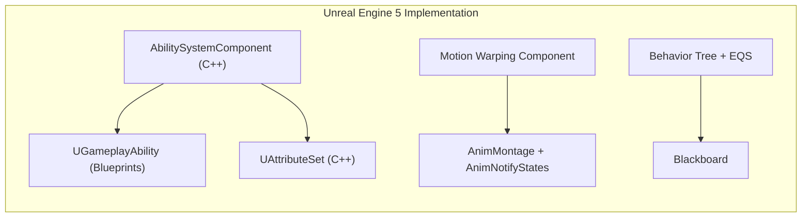
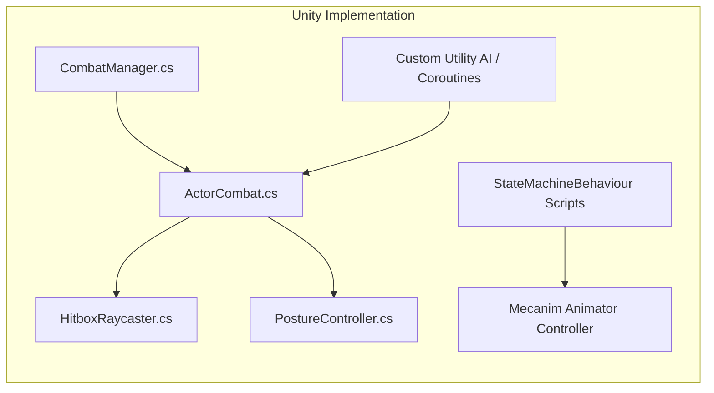
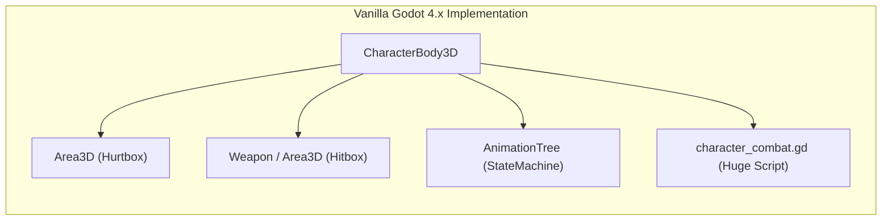
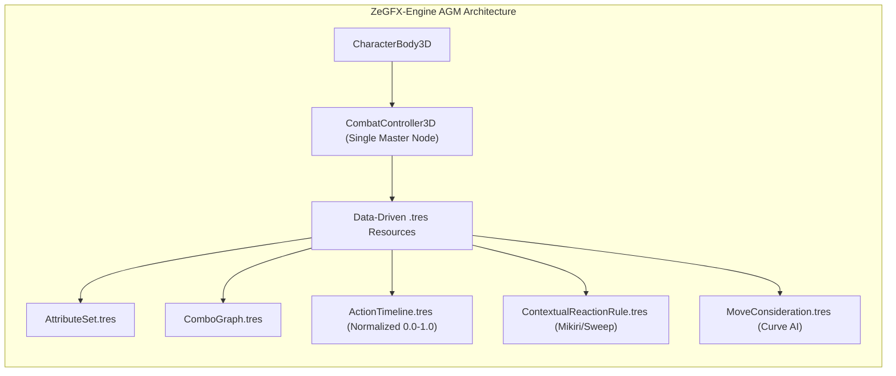

# Game Engine Combat Implementation Benchmark
## Sample Case Study: 1 Boss, 1 Arena, Sekiro-Style Sword Combat Slice

This document breaks down the end-to-end development workflow, architecture, friction points, lines of custom code, and design ergonomics for building the exact same high-precision combat slice across:
1. **Unreal Engine 5** (GAS + AnimMontage + Motion Warping + Behavior Trees)
2. **Unity Engine** (C# Monobehaviours + Animator + StateMachineBehaviours)
3. **Vanilla Godot 4.x** (GDScript + Area3D + AnimationTree + Node Composition)
4. **ZeGFX-Engine AGM** (Advanced Gameplay Mechanism: `CombatController3D` + `.tres` Resources)

---

## 1. The Benchmark Sample Specification

To guarantee a fair, 1:1 comparison, the sample consists strictly of:
* **Arena & Actors:** 1 Player (Wolf archetype) vs 1 Boss (Ashina archetype) in a circular arena.
* **Swept Blade Collision:** Multi-socket frame-swept trace along sword blades (no tunneling through 60+ FPS high-speed swings).
* **Decoupled Vitality & Posture:**
  * Posture gauge that regens only after a grace period.
  * Posture regen speed throttled by current Vitality % (100% HP = fast regen, 20% HP = sluggish).
* **Deterministic Defense Engine:**
  * **Guarding:** Mitigates 100% vitality damage, incurs posture damage.
  * **Deflection / Parry:** Tight active window (e.g. 12 frames / 200ms) with **dynamic spam contraction** (spamming block shrinks the window to 3 frames / 50ms) and inflicts posture recoil on attacker.
* **Perilous Attacks & Hard Counters:**
  * **Thrust Attack:** Unblockable ➔ Countered by Forward Dodge (**Mikiri Stomp**).
  * **Sweep Attack:** Unblockable & Unparryable ➔ Countered by **Jump Head-Kick**.
* **Frame-Exact Timelines & Cancel Windows:**
  * Buffer queues for attacks/dodges.
  * Frame-precise cancel windows to branch into dodge or next combo strike.
* **Paired Deathblow Execution:**
  * When Boss posture breaks (100%), attacker locks into synced spatial alignment and plays paired execution animation with mutual invulnerability.
* **Reactive Utility AI:**
  * Boss chooses between Light Combos, Thrusts, and Sweeps based on distance curves and player telegraph states.

---

## 2. Engine-by-Engine Implementation Breakdown

---

### A. Unreal Engine 5.4+

#### **Architecture & Setup:**
1. **Attributes & Modifiers:**
   * Create C++ class subclassing `UAttributeSet`. Define `Health`, `MaxHealth`, `Posture`, `MaxPosture`, `Stamina` using `ATTRIBUTE_ACCESSORS` macros.
   * Write boilerplate `PreAttributeChange` and `PostGameplayEffectExecute` in C++ for clamping and vitality-scaled posture regen.
2. **Abilities & Tags:**
   * Enable **Gameplay Abilities (GAS)** plugin. Add `UAbilitySystemComponent` to `ACharacter`.
   * Configure `DefaultGameplayTags.ini` with `Combat.State.Parrying`, `Combat.Telegraph.Thrust`, etc.
   * Create separate `UGameplayAbility` Blueprint assets for `GA_LightAttack_1`, `GA_LightAttack_2`, `GA_MikiriCounter`, `GA_Guard`.
3. **Hit Detection & Cancel Windows:**
   * Create custom `UAnimNotifyState` classes (`ANS_HitboxTrace`, `ANS_CancelWindow`).
   * In `ANS_HitboxTrace`, run `UKismetSystemLibrary::SphereTraceMultiByChannel` between weapon sockets (`hilt` to `tip`).
   * In `ANS_CancelWindow`, send Gameplay Events to the ASC to toggle ability cancel tags.
4. **Counters & Paired Sync:**
   * Install **Motion Warping** plugin. Define warp targets (`WarpTarget_Victim`).
   * Trigger Mikiri stomp / Deathblow via AnimMontage syncing with `RootMotion` and motion warp transforms.
5. **AI:**
   * Create `Blackboard`, `BehaviorTree`, and `EnvQueryContext` (EQS) to score distance and run task nodes `BTT_PerformThrust`.

#### **Friction Points & Complexity:**
* **Massive Boilerplate:** Requires heavy C++ scaffolding just to expose basic attributes and modifier aggregators before gameplay can even begin.
* **Asynchronous GAS Complexity:** GAS is designed for multiplayer networked replication; for local responsive singleplayer action combat, predicting local state transitions requires tedious ability activation gating.
* **Asset Bloat:** A 3-hit combo requires ~3 AnimMontages, 3 GameplayAbilities, 6 AnimNotifyStates, and 4 GameplayEffects.

* **Estimated Lines of Code / Config:** ~1,800 lines of C++ & ~35 asset files.
* **Setup Time for Slice:** **3 to 5 Days**.

---

### B. Unity (MonoBehaviour + Animator)

#### **Architecture & Setup:**
1. **Attributes & Defense State Machine:**
   * Write custom C# scripts: `Stats.cs`, `PostureController.cs`, `HitboxRaycaster.cs`, `CombatBrain.cs`.
   * Manually implement a parry timer in `Update()` with a rolling spam penalty counter (`parryWindow = Mathf.Max(0.05f, parryWindow - spamPenalty)`).
2. **Hit Detection (Swept Tracing):**
   * Write custom blade tracing in `FixedUpdate()` storing `previousSocketPositions[]` and calling `Physics.RaycastNonAlloc` or `Physics.CapsuleCast` between frames.
3. **Timelines & Cancel Windows:**
   * Create custom `StateMachineBehaviour` scripts on Animator states (`AttackStateBehaviour.cs`, `CancelWindowBehaviour.cs`) to send callbacks into `ActorCombat.cs`.
   * Mecanim Animator transitions often suffer from blend latency unless transition duration is set to `0.0s` with strict exit times.
4. **Paired Execution (Deathblow / Counters):**
   * Write custom Coroutines to Lerp/Slerp the victim’s `Transform.position` and `Transform.rotation` to match a dummy transform on the attacker, then play synced animations simultaneously via `Animator.CrossFadeInFixedTime`.
5. **AI:**
   * Write custom Utility Evaluator C# scripts calculating response curves (`Mathf.Clamp01`) in `Update()` loops.

#### **Friction Points & Complexity:**
* **Zero Built-in Combat Architecture:** Unity provides no gameplay framework out-of-the-box. Everything (damage channels, tag containers, input buffers, parry degradation) must be hand-written from absolute zero.
* **Mecanim Friction:** `StateMachineBehaviour` instances have limited access to GameObject context and frequently create spaghetti dependencies.
* **Garbage Collection (GC) Allocations:** Raycast buffer allocations, string-based Animator triggers, and delegate subscriptions must be carefully pooled to avoid GC frame hitching during fast parries.

* **Estimated Lines of Code:** ~2,400 lines of custom C# scripts.
* **Setup Time for Slice:** **4 to 6 Days**.

---

### C. Vanilla Godot 4.x (GDScript + Nodes)

#### **Architecture & Setup:**
1. **Hitboxes & Hurtboxes:**
   * Create `Area3D` nodes for `Hurtbox` and `Hitbox`.
   * Use `Area3D.area_entered` signals to detect collisions.
   * *Problem:* Standard `Area3D` physics overlaps tunnel through high-speed sword slashes at 60 FPS. Developer must write custom `ShapeCast3D` or direct `PhysicsDirectSpaceState3D.intersect_ray` swept logic in GDScript `_physics_process`.
2. **Timelines & Windows:**
   * Use `AnimationPlayer` Call Method tracks to invoke GDScript functions like `open_cancel_window()` and `enable_hitbox()`.
   * Because Call Method tracks are tied to wall-clock timeline seconds, scaling attack speed or handling hitstop freeze requires manual `AnimationPlayer.playback_speed` manipulation.
3. **Defense & Counter-Reactions:**
   * Write custom GDScript dictionaries for input buffering, parry fatigue timers, and posture regen step curves.
   * Check string signals like `_on_hit_received(type)` with large `match` statements (`match attack_type: "thrust": ...`).
4. **Paired Interactions:**
   * In GDScript, write `Tween` or `create_tween()` to align the victim’s `global_transform` to a marker on the player before playing synced animations.

#### **Friction Points & Complexity:**
* **Node Soup Hierarchy:** Each character ends up with 10+ child nodes (`Area3D`, `CollisionShape3D`, `Marker3D`, `Timer`, `RayCast3D`, `AnimationTree`, `AudioStreamPlayer3D`).
* **Signal Spaghetti:** Heavy reliance on signal wiring (`area_entered`, `timeout`, `animation_finished`) makes debugging parry race conditions difficult.
* **Performance Limits:** Doing multi-socket swept physics raycasts and utility AI curve math purely in interpreted GDScript across multiple enemies creates CPU bottlenecks.

* **Estimated Lines of Code:** ~1,600 lines of GDScript across 12 scripts.
* **Setup Time for Slice:** **3 to 4 Days**.

---

### D. ZeGFX-Engine AGM (Advanced Gameplay Mechanism)

#### **Architecture & Setup:**
1. **Scene Setup (1 Single Node):**
   * Add **`CombatController3D`** as a child of the `CharacterBody3D`.
   * In inspector, select socket tracking bones: `["Blade_Hilt", "Blade_Tip"]`.
2. **Attributes & Tags (`.tres`):**
   * Assign `Player_Attributes.tres`:
     * `Health`: `1000.0`, `Posture`: `400.0` (Regen delay: `1.0s`, Regen curve assigned).
     * Cut-rate mitigation matrix defined directly in resource properties.
3. **Authoring Actions & Timelines (`ActionTimeline.tres`):**
   * Create timeline with phase-normalized tracks (0.0 to 1.0):
     * `HitboxTimelineTrack`: Phase `0.30 → 0.55` (Damage: 80 Slash, 30 Posture).
     * `CancelWindowTimelineTrack`: Phase `0.45 → 0.95` (`Action.Dodge`, `Action.ComboNext`).
     * `NotifyTimelineTrack`: Keyframe at `0.32` triggers camera shake & hitstop.
4. **Defense & Hard-Counters (`ContextualReactionRule.tres`):**
   * Add 2 rules in the inspector:
     1. `Threat: Combat.Telegraph.Thrust` + `Input: DodgeForward` ➔ `Action: MikiriStomp`.
     2. `Threat: Combat.Telegraph.Sweep` + `Input: Jump` ➔ `Action: JumpHeadKick`.
5. **Combos & AI:**
   * Wire `ComboGraph.tres` with visual priority edges.
   * On Boss, check `enable_ai = true` and assign `MoveConsideration` distance curves.
6. **Execution / Deathblow:**
   * Call `combat.perform_takedown(boss, deathblow_interaction)`—native C++ handles spatial alignment lerp, state locks, and tag application automatically.

#### **Advantages & Ergonomics:**
* **Zero Node Clutter:** 1 Node on the actor handles everything.
* **Frame-Exact & Bulletproof:** Native C++ swept ray tracing between sockets runs in physics ticks (0 tunneling, 0 GC allocations).
* **Hot-Reloadable Data:** Designers balance parry windows, damage cut-rates, and cancel timings purely in `.tres` inspectors without recompiling or writing glue code.

* **Lines of Custom Code Needed:** **~50 to 80 lines of high-level GDScript** (purely player movement & input forwarding).
* **Setup Time for Slice:** **2 to 4 Hours**.

---

## 3. Side-by-Side Comparison Matrix

| Feature / Metric | Unreal Engine 5 (GAS) | Unity (Custom C#) | Vanilla Godot 4 (GDScript) | **ZeGFX-Engine (AGM)** |
| :--- | :--- | :--- | :--- | :--- |
| **Actor Scene Hierarchy** | Moderate (Component + Mesh + AnimInstance) | Heavy Node/Component Soup | Heavy (10+ Child Nodes per actor) | **Ultra-Clean (1 Master Hub Node)** |
| **Lines of Custom Code** | ~1,800 lines (C++ / BPs) | ~2,400 lines (C#) | ~1,600 lines (GDScript) | **~60 lines (GDScript/C# API)** |
| **Setup Time for Slice** | 3 – 5 Days | 4 – 6 Days | 3 – 4 Days | **2 – 4 Hours** |
| **Hitbox Tunneling Prevention** | Requires custom PhysX line trace ANS | Requires manual `FixedUpdate` Raycast script | Prone to tunneling (Area3D) or custom script | **Native C++ Multi-Socket Swept Tracing** |
| **Dynamic Parry Window Decay** | Manual GAS tag counting & timing | Custom C# timer & penalty state | Custom GDScript timers & signals | **Built-in `DefenseComponent` (Native C++)** |
| **Hard Counters (Mikiri/Sweep)** | Complex Gameplay Event routing | Custom trigger checks & state machine | String-matching signal spaghetti | **Data-driven `ContextualReactionRule` table** |
| **Attack-Speed / Hitstop Scaling** | Montage Play Rate scaling (can desync ANS) | Manual Delta Time manipulation | Manual `playback_speed` hacking | **Phase-Normalized Timelines (0.0–1.0)** |
| **Paired Sync Alignment** | Motion Warping Plugin setup | Custom Coroutines & Transform Lerping | Manual `Tween` scripts | **Native `SyncPointComponent` alignment** |
| **Designer Iteration Speed** | Slow (Compiling BPs / Montages) | Slow (Script editing & Inspector wiring) | Moderate (Editing scene nodes & scripts) | **Instant (Hot-reloading `.tres` Resources)** |

---

## 4. Key Takeaways for Tuning ZeGFX-Engine AGM

1. **Keep the "1 Actor = 1 Node" Rule:** 
   * Unreal and Unity force developers to assemble a maze of components. By bundling combat logic into [`CombatController3D`](file:///y:/ZeGFX-Engine/modules/gameplay/core/combat_controller_3d.h), ZeGFX-Engine eliminates 90% of scene clutter.
2. **Double Down on Phase-Normalized Timelines:** 
   * Anchoring hitboxes and cancel windows from `0.00` to `1.00` rather than fixed seconds is AGM's biggest superpower over UE5 and Unity, allowing attack speed buffs and hitstops without desynchronizing windows.
3. **Data-Driven Rule Tables are Essential:** 
   * Handling hard-counters (like Mikiri Stomp against Thrusts) via declarative [`ContextualReactionRule`](file:///y:/ZeGFX-Engine/modules/gameplay/defense/contextual_reaction_rule.h) tables saves hundreds of lines of fragile conditional code compared to Unity or Vanilla Godot.
4. **Zero-Boilerplate Scripting:** 
   * The GDScript / C# interface should stay as simple as `combat.play_action("Slash")`, `combat.start_guard()`, and `combat.try_counter()`.
