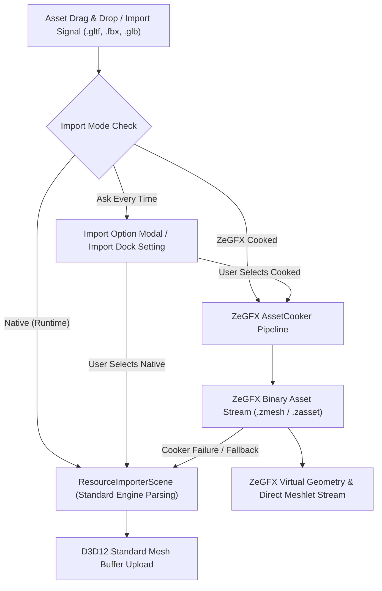

# ZeGFX Asset Cooking & AAA Import Pipeline Specification (`ZEGFXASSETSCOOKING.md`)

This document outlines the technical specification and architectural plan for the **ZeGFX Asset Cooking & AAA 3D Import Pipeline**, detailing how raw 3D assets (`.gltf`, `.glb`, `.fbx`, `.obj`) are transformed into GPU-optimized streaming binaries, along with the **Dual-Mode Import Strategy** (Native Runtime vs. ZeGFX Cooked) for editor stability.

---

## 1. AAA-Grade 3D Asset Import Pipeline Architecture

To elevate the 3D model import pipeline from a basic importer (parsing raw glTF/FBX meshes into CPU/GPU arrays) to a **AAA-grade asset import pipeline** (comparable to Unreal Engine 5 Nanite, Frostbite, Decima, or REDengine), the engine transforms raw source geometry into GPU-optimized, streaming-ready binary formats during the import step.

Below is the technical breakdown of the 8 core pillars required in the import pipeline to reach AAA grade.

---

### Pillar 1: Virtual Geometry & Meshlet Cluster Generation

Basic importers create monolithic vertex and index buffers per submesh, which forces the GPU to rasterize entire objects or perform coarse frustum culling.

* **Meshlet Partitioning (Clusterization):**
  * During import, split dense surface meshes into small clusters called **Meshlets** (typically 64 vertices and 128 triangles per meshlet).
  * Use library tools like `meshoptimizer` (`meshopt_buildMeshlets`) already present in `thirdparty/meshoptimizer/meshoptimizer.h`.
* **Bounding Volumes & Normal Cone Calculation:**
  * For every meshlet, compute a tight **Bounding Sphere / AABB** and a **Normal Cone (axis & cutoff angle)** at import time.
  * Store this metadata in the imported asset binary. This enables GPU compute shaders to perform frustum culling and backface culling per 64-vertex cluster before rasterization.
* **Hierarchical DAG Clusters (Nanite-Style):**
  * Build a Directed Acyclic Graph (DAG) of meshlet clusters across simplification levels, allowing seamless continuous LOD streaming without visual popping.

---

### Pillar 2: GPU Buffer & Vertex Cache Optimization

Raw exported models from 3D software (Blender/Maya) have unoptimized triangle indices that cause poor GPU cache hit rates and extra vertex shader dispatches.

During the import bake step, run the mesh data through 4 optimization passes:

1. **Vertex Cache Optimization (`meshopt_optimizeVertexCache`):** Reorders triangle indices to maximize the GPU post-transform vertex cache hit rate (minimizes Average Transformed Triangles per Vertex - ACMR).
2. **Overdraw Minimization (`meshopt_optimizeOverdraw`):** Reorders triangles to render near-to-far surfaces first within clusters, reducing G-Buffer overdraw cost.
3. **Vertex Fetch Optimization (`meshopt_optimizeVertexFetch`):** Rearranges the vertex buffer memory order to match the optimized index buffer order, maximizing GPU memory L2 cache locality.
4. **Vertex Attribute Stream Splitting:** Split vertices into separate streams:
   * **Position-Only Stream (`float3`):** Used for depth-only prepasses, shadow map rendering, and DXR ray-tracing acceleration structures.
   * **Attribute Stream (Normals, UVs, Tangents, Colors):** Loaded only during full G-Buffer opaque rendering passes.

---

### Pillar 3: Automatic LOD & Mesh Simplification

AAA engines never rely on artists manually creating LODs for every prop.

* **Quadratic Error Metrics (QEM) Simplification:**
  * Automatically generate **LOD 0 through LOD 4** during import using QEM edge-collapse algorithms (`meshopt_simplify`).
  * Lock boundary vertices (UV chart borders, material boundaries, and seam edges) during simplification to prevent gaps/cracks from forming between LODs.
* **Impostor / Octahedral Card Generation:**
  * For extreme distance rendering (LOD 5 / foliage / mega-structures), automatically bake 360-degree octahedron texture impostors or 3D volume cards during import.

---

### Pillar 4: High-Precision Tangents & Octahedral Encoding

Importing raw `float3` normals (12 bytes) and `float4` tangents (16 bytes) wastes VRAM bandwidth and causes lighting shading seams across UV borders.

* **MikkTSpace Tangent Generation:**
  * Enforce the industry-standard **MikkTSpace algorithm** on import for calculating tangent spaces. This guarantees 100% pixel-accurate normal mapping matching Substance Painter, XNormal, and Blender bakes.
* **Octahedral Normal/Tangent Quantization:**
  * Compress 3D unit normal vectors into Octahedral 2D coordinates stored as 16-bit signed integers (`SNORM16_2` - 4 bytes total instead of 12 bytes).
  * Doubles VRAM bandwidth throughput on the GPU G-Buffer geometry pass.

---

### Pillar 5: AAA Texture & Material Import Pipeline

* **Texture Packing (ORMI Channels):**
  * Automatically combine single-channel PBR textures into single packed textures:
    * **R:** Roughness
    * **G:** Metallic
    * **B:** Ambient Occlusion (AO)
    * **A:** Inverted Gloss / Detail Mask
  * Reduces 4 separate texture sampling instructions in HLSL down to 1.
* **GPU Hardware Compression (BC1–BC7 & KTX2):**
  * **BC5 (`RG8`):** Compress normal maps using BC5 (stores X & Y components; shader reconstructs Z via $Z = \sqrt{1 - X^2 - Y^2}$). Eliminates green/blue artifacts common in BC3 normal maps.
  * **BC7 (`RGBA8`):** Compress base color, albedo, and packed ORMI textures for high-fidelity HDR color retention.
  * **KTX2 / Basis Universal:** Transcode textures to KTX2 container format for instant GPU VRAM streaming.

---

### Pillar 6: Animation, Rigging & Skinning Optimizations

* **Animation Compression Library (ACL):**
  * Integrate ACL (Animation Compression Library) into the importer. ACL compresses bone tracks (scale/rotation/translation curves) down to 10–15% of their raw size with zero visual loss.
* **Weight Pruning & Quantization:**
  * Prune tiny bone influence weights ($< 0.001$) and renormalize remaining weights to fit within 4 (or 8) influences per vertex.
  * Quantize weights to packed 8-bit unsigned integers (`uint32_t` containing 4x8-bit values), saving 75% memory over `float4` weight arrays.

---

### Pillar 7: Collision Hulls & DXR Acceleration Proxies

* **V-HACD Convex Hull Decomposition:**
  * Use V-HACD (Volumetric Hierarchical Approximate Convex Decomposition) on import to generate compound convex collision hulls for rigid bodies, avoiding heavy tri-mesh collision solvers.
* **DXR Acceleration Proxy Generation:**
  * For Hardware Ray Tracing (DXR 1.1), generate low-poly proxy geometries during import to build Bottom-Level Acceleration Structures (BLAS), drastically accelerating ray-triangle intersection testing.

---

### Pillar 8: Zero-Copy Binary Asset Format (`.zmesh` / `.zasset`)

Replacing slow runtime text/JSON/glTF/FBX parsing with a proprietary, memory-mapped binary asset file format:

```
+-------------------------------------------------------------------+
|                     AAA BINARY ASSET HEADER                       |
|  - Magic Header / Asset Versioning / Hash                         |
|  - Meshlet Count / LOD Offset Table / AABB & Sphere Bounds        |
+-------------------------------------------------------------------+
|               DIRECT3D 12 DMA-READY BUFFER SLICES                 |
|  - Position Buffer (Position-only float3)                         |
|  - Packed Attribute Buffer (Octahedral Normals, UVs, Tangents)    |
|  - Meshlet Data Array (Vertex offsets, Triangle offsets, Cones)   |
|  - Compressed Texture Mip Streams (BC5 / BC7 / KTX2)             |
+-------------------------------------------------------------------+
```

* **Zero Engine Load Stalls:** The engine opens `.zmesh` and issues a direct DMA copy from disk directly into the Direct3D 12 `UploadRingBuffer` without CPU parsing overhead.

---

## Action Plan Summary for ZeGFX Import Pipeline

1. **Wire up `thirdparty/meshoptimizer/` in the asset import step:**
   * Run `meshopt_optimizeVertexCache`, `meshopt_optimizeVertexFetch`, and `meshopt_optimizeOverdraw` on all imported geometries.
   * Generate meshlet clusters via `meshopt_buildMeshlets`.
2. **Standardize Tangents & Quantization:**
   * Enforce MikkTSpace tangent calculation and octahedral normal encoding (`SNORM16_2`).
3. **Texture Packing & BC5/BC7 Compression:**
   * Automatically pack Roughness/Metallic/AO into single ORMI textures and compress normal maps to BC5 format.
4. **Binary Caching:**
   * Save processed geometry directly to an engine binary cache (`.zmesh`), bypassing glTF re-parsing on scene startup.

---

## 2. Dual-Mode Asset Import Pipeline (Native vs. ZeGFX Cooked)

### Executive Strategy & Endorsement

**Adopting a dual-mode import strategy is strongly recommended.**

During graphics engine migration and pipeline hardening, having a dual-path asset pipeline prevents project blockage when experimental asset cooking features (such as binary serialization, meshlet generation, or texture channel packing) hit edge cases.

#### Core Benefits of Dual Approach
1. **Zero-Blocker Development**: If an asset fails to cook or exhibits shading artifacts under `ZeGFX::AssetCooker`, developers can instantly switch the asset's import mode to **Native**, bypassing the cooker to keep working immediately.
2. **Side-by-Side A/B Validation**: Enables direct visual and performance comparison between standard runtime engine meshes and fully pre-cooked `.zmesh` binary assets in the D3D12 render pipeline.
3. **Graceful Degraded Mode**: Allows incremental stabilization of the `ZeGFX::AssetCooker` without breaking scene loading across the engine editor.

---

### Import Mode Settings & Workflow

> [!IMPORTANT]
> **Default Setting Behavior**: The recommended default import mode is set to **"Ask Every Time"** or **"Native (Fallback Ready)"** in project settings during the current DX12 migration phase. When dragging assets into the editor, a lightweight modal option or Import Dock selector allows selecting the processing path.

---

### Architectural Flow



---

### Component Breakdown & Integration Points

#### 1. [resource_importer_scene.h](file:///z:/ZeGFX-Engine/editor/import/3d/resource_importer_scene.h) & [resource_importer_scene.cpp](file:///z:/ZeGFX-Engine/editor/import/3d/resource_importer_scene.cpp)
* Add a new import option enum property to scene import options:
  * `IMPORT_MODE_NATIVE` (Standard engine scene importer)
  * `IMPORT_MODE_ZEGFX_COOKED` (ZeGFX `AssetCooker` pipeline)
  * `IMPORT_MODE_ASK_ON_IMPORT` (Triggers user selection prompt)
* Implement automatic fallback logic: If `IMPORT_MODE_ZEGFX_COOKED` encounters a cooking error or missing texture dependencies, emit an editor warning and automatically complete import using `IMPORT_MODE_NATIVE`.

#### 2. [scene_import_settings.cpp](file:///z:/ZeGFX-Engine/editor/import/3d/scene_import_settings.cpp)
* Add a visual **Asset Import Pipeline** dropdown in the 3D Scene Import Settings dialog header:
  * **Native Engine Format**: Raw vertex/index arrays, fast runtime parsing, 100% stable compatibility.
  * **ZeGFX Cooked Format (`.zmesh`)**: Pre-baked meshlets (`meshoptimizer`), packed BC5/BC7 textures, zero-copy D3D12 DMA streaming.

#### 3. [asset_cooker.cpp](file:///z:/ZeGFX-Engine/ZeGFX/src/cooker/asset_cooker.cpp) & [asset_cooker.h](file:///z:/ZeGFX-Engine/ZeGFX/include/cooker/asset_cooker.h)
* Harden error reporting in `AssetCooker::CookMesh` and `AssetCooker::CookTexture` to return explicit error status structures (`CookResult`), enabling clean fallbacks in the editor importer layer.

---

### Verification & Testing Plan

#### Manual Verification
1. **Native Mode Verification**: Import a complex `.gltf` asset with `IMPORT_MODE_NATIVE`. Verify scene loads in editor viewport under Direct3D 12 renderer without error.
2. **Cooked Mode Verification**: Re-import the same asset using `IMPORT_MODE_ZEGFX_COOKED`. Verify `.zmesh` binary cache is generated and rendered.
3. **Fallback Behavior**: Intentionally break/corrupt a cooked asset dependency and trigger re-import. Verify editor cleanly degrades to Native mode with an informative warning log.
