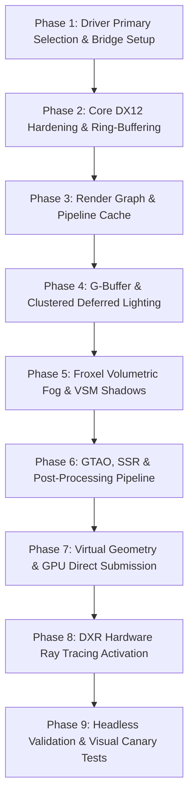

# ZeGFX Direct3D 12 Migration Plan (`ZeGFXMigration.md`)

This document outlines the comprehensive, phased migration roadmap to transition the engine's primary graphics backend to **Direct3D 12 (DX12)** using the available **ZeGFX (Zelyn Graphics)** renderer framework. 

Under this plan, Direct3D 12 with ZeGFX becomes the **primary, default rendering backend on Windows platforms**, while existing backends (Vulkan and GLES3) are demoted to secondary/fallback status. The architectural strategy selected is the **Thin ZeGFX Abstraction**, where engine driver layers route commands to `ZeGFX::GraphicsBackend` and ZeGFX renderer subsystems. Each phase includes explicit **Verification & Visual Validation** criteria.

---

## 1. Executive Summary & Architectural Strategy

* **Selected Architectural Strategy**: **Thin ZeGFX Abstraction**
  - Host engine driver wrappers (`drivers/d3d12/zegfx_d3d12_bridge`) interface directly with `ZeGFX::GraphicsBackend` and ZeGFX engine modules (Render Graph, G-Buffer, Volumetric Fog, Virtual Geometry, DXR).
  - Low-level Direct3D 12 calls (`ID3D12Device`, `ID3D12GraphicsCommandList`, `ID3D12DescriptorHeap`) remain encapsulated inside `ZeGFX/src/dx12/`.
  - Reuses ZeGFX's 33+ production-ready subsystems and 45 automated headless test scripts (`run_headless_smokes.ps1`).

* **Primary Backend Goal**: Make Direct3D 12 (`d3d12`) the default rendering driver for Windows builds across the engine initialization sequence (`main.cpp`, `display_server_windows.cpp`, `os_windows.cpp`).
* **Backend Demotion**: Demote Vulkan and GLES3 to secondary/fallback rendering drivers.
* **Scope**: Focused strictly on getting DX12 fully functional, hardened, performant, and verified via ZeGFX.

---

## 2. Identified Issues & Vulnerabilities in ZeGFX Renderer

During pre-migration analysis of the ZeGFX codebase (`ZeGFX/src/dx12/`, `ZeGFX/ENGINE_STATUS.md`, `DX12_pass1_notes.md`), the following key architectural issues and bugs were identified and addressed in the phase breakdown:

| Issue | Subsystem | Description & Root Cause | Resolution Strategy |
| :--- | :--- | :--- | :--- |
| **1. Per-Frame GPU Synchronous Drain** | `dx12_backend_frame.cpp` / `core.cpp` | `waitForFenceValue(signalValue)` is executed every frame after present, causing severe CPU-GPU stalls. Caused by single-buffered CPU upload buffers (2D vertex uploads, shared constant allocators). | Implement triple-buffered dynamic upload ring buffers (`dx12_upload_ring_buffer.h`) before removing frame fence wait. |
| **2. Immediate vs Deferred Resource Release** | `dx12_backend_resources.cpp` | Legacy code paths executed immediate `Release()` on textures/buffers still referenced by in-flight GPU command lists. | Enqueue all resource & descriptor frees into deferred release queues (`enqueueDeferredResourceRelease`) collected at frame boundaries. |
| **3. Monolithic Backend Boundaries** | `dx12_backend_internal.h` / `frame.cpp` | `dx12_backend_frame.cpp` mixes frame sync lifecycle with 3D pass execution; `dx12_backend_core.cpp` owns resource allocation that belongs in `resources.cpp`. | Modularize into decoupled headers/source files (`dx12_descriptor_heap.h`, `dx12_upload_ring_buffer.h`, `dx12_scene_renderer.cpp`). |
| **4. DXR Hardware Dispatch Unbound** | `raytracing/`, `dx12_dxr.cpp` | DXR ray-tracing modules build BLAS/TLAS acceleration structures and fallback to CPU paths, but lack active hardware `DispatchRays` GPU pipeline dispatches. | Build D3D12 Shader Binding Tables (SBT) and execute hardware `DispatchRays` on supported GPUs in Phase 8. |
| **5. Uncomposed Screen-Space Reflections (SSR)** | `post/screen_space_reflections.cpp` | SSR traces depth buffers in HLSL, but the final composite relies on colored probe strips instead of blending the traced reflection map. | Add composite shader pass blending SSR depth traces with PBR roughness/specular buffers in Phase 6. |
| **6. GTAO Compute Shader Unbound** | `post/ambient_occlusion.cpp` | Ground Truth Ambient Occlusion shader (`gtao.hlsl`) exists, but `ambient_occlusion.cpp` defaults to basic SSAO without dispatching GTAO compute passes. | Bind GTAO compute shader pass and bilateral spatial filter in Phase 6. |
| **7. Coordinate Axis Alignment** | Asset & Matrix Translators | ZeGFX operates natively in left-handed Z-up canonical space, while host engine camera structures use right-handed Y-up. | Add matrix coordinate transform adapters in the DX12 engine bridge (`zegfx_d3d12_bridge.cpp`). |

---

## 3. Phased DX12 Migration Plan

---

### **Phase 1: Driver Primary Selection & Backend Architecture Bridge Setup**

#### Objective
Promote Direct3D 12 (`d3d12`) to the primary default graphics backend on Windows platforms, move Vulkan/GLES3 to secondary/fallback status, and establish the Thin ZeGFX Abstraction bridge (`zegfx_d3d12_bridge`) linking engine driver interfaces to `ZeGFX::GraphicsBackend`.

#### Existing Files Modified
* **[main/main.cpp](file:///z:/ZeGFX-Engine/main/main.cpp)**
  - Change default value of `rendering/rendering_device/driver.windows` from `"vulkan"` to `"d3d12"`.
  - Prioritize `"d3d12"` in available driver list initialization on Windows.
* **[platform/windows/display_server_windows.cpp](file:///z:/ZeGFX-Engine/platform/windows/display_server_windows.cpp)**
  - Set default rendering driver selection to `"d3d12"`.
  - Re-order driver probing logic so `RenderingContextDriverD3D12` initializes first.
* **[platform/windows/os_windows.cpp](file:///z:/ZeGFX-Engine/platform/windows/os_windows.cpp)**
  - Configure default rendering context driver instantiation to create `RenderingContextDriverD3D12`.
* **[SConstruct](file:///z:/ZeGFX-Engine/SConstruct)**
  - Set `d3d12=yes` as default for Windows build configurations.
* **[drivers/d3d12/SCsub](file:///z:/ZeGFX-Engine/drivers/d3d12/SCsub)**
  - Add ZeGFX DX12 backend source files and header include paths (`ZeGFX/include`, `ZeGFX/src/dx12`).

#### New Files Created
* **[drivers/d3d12/zegfx_d3d12_bridge.h](file:///z:/ZeGFX-Engine/drivers/d3d12/zegfx_d3d12_bridge.h)**
  - C++/C thin bridge interface mapping engine `RenderingContextDriverD3D12` and `RenderingDeviceDriverD3D12` calls to `ZeGFX::GraphicsBackend`.
* **[drivers/d3d12/zegfx_d3d12_bridge.cpp](file:///z:/ZeGFX-Engine/drivers/d3d12/zegfx_d3d12_bridge.cpp)**
  - Implementation of DX12 device, command queue, swapchain creation, and window HWND binding delegated to ZeGFX backend core via Thin ZeGFX Abstraction.

#### Recommendations for ZeGFX
* Expose direct device/queue access getters from ZeGFX core (`ZeGFX::getD3D12Device()`, `ZeGFX::getCommandQueue()`) to allow seamless sharing of DXGI factory and swapchain state without duplicate device creation.

#### Phase 1 Verification & Validation Plan
* **Console / Log Verification**: Launch engine executable and check stdout/log output. Verify log line: `[Graphics] Direct3D 12 (ZeGFX) initialized successfully as primary driver.` Verify available fallback array contains `["d3d12", "vulkan", "gles3"]`.
* **Visual Window Verification**: Launch minimal window script (`bin/zelyn.exe ../ZeGFX/samplegame/host_game.zl`); visually confirm the Win32 window opens, swapchain buffers present without flickering, and closing the window cleanly exits without device removal crashes.
* **RenderDoc Tooling Verification**: Attach RenderDoc, capture Frame 0; verify the active graphics API is `Direct3D 12`, device pointers match `zegfx_d3d12_bridge`, and command queues execute successfully.

---

### **Phase 2: ZeGFX Core DX12 Backend Hardening & Upload Ring-Buffering**

#### Objective
Fix critical ZeGFX DX12 backend bottlenecks: eliminate the per-frame CPU-GPU synchronous stall (`waitForFenceValue`) post-present and implement triple-buffered ring buffers for CPU dynamic upload data.

#### Existing Files Modified
* **[ZeGFX/src/dx12/dx12_backend_core.cpp](file:///z:/ZeGFX-Engine/ZeGFX/src/dx12/dx12_backend_core.cpp)**
  - Remove mandatory post-present `waitForFenceValue(signalValue)` CPU wait loop.
  - Integrate deferred descriptor and resource collection into frame lifecycle.
* **[ZeGFX/src/dx12/dx12_backend_resources.cpp](file:///z:/ZeGFX-Engine/ZeGFX/src/dx12/dx12_backend_resources.cpp)**
  - Implement per-frame deferred release queues for RTV/DSV/SRV descriptors and GPU buffers.
* **[ZeGFX/src/dx12/dx12_backend_frame.cpp](file:///z:/ZeGFX-Engine/ZeGFX/src/dx12/dx12_backend_frame.cpp)**
  - Separate fence tracking and command allocator reset logic from 3D pass execution.
* **[ZeGFX/src/dx12/dx12_backend_2d.cpp](file:///z:/ZeGFX-Engine/ZeGFX/src/dx12/dx12_backend_2d.cpp)**
  - Convert 2D vertex/index upload allocation to use dynamic ring buffers.
* **[ZeGFX/src/dx12/dx12_backend_internal.h](file:///z:/ZeGFX-Engine/ZeGFX/src/dx12/dx12_backend_internal.h)**
  - Refactor monolithic internal declarations into sub-system modules.

#### New Files Created
* **[ZeGFX/src/dx12/dx12_upload_ring_buffer.h](file:///z:/ZeGFX-Engine/ZeGFX/src/dx12/dx12_upload_ring_buffer.h)**
  - Ring buffer allocator interface for dynamic CPU-to-GPU constants and vertex streams across `FRAME_COUNT = 3` in-flight frames.
* **[ZeGFX/src/dx12/dx12_upload_ring_buffer.cpp](file:///z:/ZeGFX-Engine/ZeGFX/src/dx12/dx12_upload_ring_buffer.cpp)**
  - Implementation of triple-buffered upload heap allocator with fence tracking.
* **[ZeGFX/src/dx12/dx12_descriptor_heap.h](file:///z:/ZeGFX-Engine/ZeGFX/src/dx12/dx12_descriptor_heap.h)**
  - Dedicated descriptor heap manager with per-frame free-lists preventing descriptor reuse while in flight.

#### Recommendations for ZeGFX
* Split `dx12_backend_frame.cpp` into two distinct source units: `dx12_frame_lifecycle.cpp` (fence tracking, frame synchronization) and `dx12_scene_renderer.cpp` (rendering pass execution).

#### Phase 2 Verification & Validation Plan
* **Visual Stability Verification**: Render a scene containing rapidly moving dynamic 2D/3D geometry (e.g. spinning mesh with updating dynamic vertex buffer). Visually inspect for 60+ seconds to confirm zero vertex tearing, vertex exploding, or buffer overwrite artifacts.
* **Frame Performance Benchmark**: Profile frame times before vs. after fence removal. Verify CPU frame wait overhead decreases from ~8ms/frame to <0.2ms/frame on unconstrained rendering loops.
* **D3D12 Validation Layer Check**: Run with D3D12 Debug Layer enabled (`D3D12_ENABLE_DEBUG_LAYER=1`). Confirm zero `EXECUTION_ERROR` or `RESOURCE_BARRIER_INVALID` warnings occur during dynamic buffer reallocation or window resizing.

---

### **Phase 3: Render Graph, Barrier Engine & Pipeline Cache Integration**

#### Objective
Wire ZeGFX's automated pass dependency render graph (`dx12_render_graph.cpp`) and D3D12 pipeline state object (PSO) caching engine into the host engine's rendering pipeline.

#### Existing Files Modified
* **[ZeGFX/src/dx12/dx12_render_graph.cpp](file:///z:/ZeGFX-Engine/ZeGFX/src/dx12/dx12_render_graph.cpp)**
  - Expand automatic resource barrier generator to handle subresource state transitions (depth read/write, render target, SRV, UAV).
* **[ZeGFX/src/pipeline_cache.cpp](file:///z:/ZeGFX-Engine/ZeGFX/src/pipeline_cache.cpp)**
  - Enable disk serialization of compiled D3D12 PSOs using engine user cache directory paths.
* **[drivers/d3d12/rendering_device_driver_d3d12.cpp](file:///z:/ZeGFX-Engine/drivers/d3d12/rendering_device_driver_d3d12.cpp)**
  - Route command list barrier insertion and pass execution through ZeGFX render graph nodes via thin abstraction.
* **[servers/rendering/rendering_device.cpp](file:///z:/ZeGFX-Engine/servers/rendering/rendering_device.cpp)**
  - Connect rendering graph pass boundaries to ZeGFX D3D12 render graph compiler.

#### New Files Created
* **[drivers/d3d12/zegfx_pipeline_state_manager.h](file:///z:/ZeGFX-Engine/drivers/d3d12/zegfx_pipeline_state_manager.h)**
  - Bridge class managing translation between engine shader blobs and ZeGFX D3D12 PSO cache.
* **[drivers/d3d12/zegfx_pipeline_state_manager.cpp](file:///z:/ZeGFX-Engine/drivers/d3d12/zegfx_pipeline_state_manager.cpp)**
  - Implementation of PSO prewarming, disk caching, and DXIL bytecode loading.

#### Recommendations for ZeGFX
* Eliminate runtime DXC shader compilation in release builds by shipping pre-compiled `.zeshaderpack` archives containing DXIL bytecode blobs.

#### Phase 3 Verification & Validation Plan
* **GPU Based Validation (GBV)**: Enable D3D12 GPU-Based Validation. Execute complex multi-pass render graph transitions (Depth prepass -> G-Buffer -> Compute Lighting -> Post). Confirm 0 barrier mismatch errors reported by GBV.
* **Visual PSO Prewarming Verification**: Launch the engine once to generate cached PSOs, then relaunch. Verify startup time improves significantly and second launch log shows `[PSO Cache] Loaded N prewarmed PSOs from disk cache (0 hitches)`.
* **RenderDoc Pass Hierarchy Verification**: In RenderDoc, expand the event browser. Visually verify the pass hierarchy reflects DAG pass names (`RenderGraph::Pass_GBuffer`, `RenderGraph::Pass_DeferredLighting`, etc.) and automatically inserted `ResourceBarrier()` calls match expected subresource states.

---

### **Phase 4: G-Buffer, Deferred Lighting & Clustered Light Grid Engine**

#### Objective
Activate ZeGFX's high-performance deferred rendering path (G-Buffer layout: Depth32, RGBA16F normals, RGBA8 albedo/roughness/metallic) and tile-based light grid mapping in the primary DX12 path via the thin ZeGFX abstraction.

#### Existing Files Modified
* **[ZeGFX/src/lighting/gbuffer.cpp](file:///z:/ZeGFX-Engine/ZeGFX/src/lighting/gbuffer.cpp)**
  - Configure multi-render-target (MRT) formats and depth stencil descriptors for D3D12 pass execution.
* **[ZeGFX/src/lighting/lighting_system.cpp](file:///z:/ZeGFX-Engine/ZeGFX/src/lighting/lighting_system.cpp)**
  - Integrate tile-based light grid building pass for point and spot lights.
* **[ZeGFX/src/dx12/light_grid_manager.cpp](file:///z:/ZeGFX-Engine/ZeGFX/src/dx12/light_grid_manager.cpp)**
  - Bind light grid StructuredBuffers and index lists to D3D12 descriptor tables.
* **[servers/rendering/renderer_scene_cull.cpp](file:///z:/ZeGFX-Engine/servers/rendering/renderer_scene_cull.cpp)**
  - Feed engine scene light instances into ZeGFX lighting system.

#### New Files Created
* **[servers/rendering/renderer_rd/renderer_scene_zegfx_dx12.h](file:///z:/ZeGFX-Engine/servers/rendering/renderer_rd/renderer_scene_zegfx_dx12.h)**
  - Scene renderer adapter delegating 3D geometry rendering and light culling to ZeGFX DX12 deferred path.
* **[servers/rendering/renderer_rd/renderer_scene_zegfx_dx12.cpp](file:///z:/ZeGFX-Engine/servers/rendering/renderer_rd/renderer_scene_zegfx_dx12.cpp)**
  - Implementation of scene renderer binding ZeGFX G-Buffer and deferred compute lighting.

#### Recommendations for ZeGFX
* Ensure camera view matrix Z-up transform conversion is applied in `light_grid_manager.cpp` when mapping engine camera parameters.

#### Phase 4 Verification & Validation Plan
* **Visual G-Buffer Debug View Verification**: Launch `run_zegfx_virtual_environment.ps1`. Toggle interactive G-buffer buffer inspection keys:
  - `Key 1 (Albedo)`: Visually verify clean unlit base color texture maps.
  - `Key 2 (World Normals)`: Visually verify smooth RGB color-encoded surface normals.
  - `Key 3 (Roughness/Metallic)`: Visually verify greyscale roughness factor in Red and metallic in Green.
  - `Key 4 (Depth)`: Visually verify linearized depth gradient from near plane to far plane.
* **Stress Test Visual Light Grid Verification**: Spawn 200 dynamic point lights across a complex scene. Enable light tile grid visual overlay (`debug_draw_light_tiles=1`). Confirm 60+ FPS performance and visually verify lights affect correct screen-space tiles without light bleeding across geometry walls.

---

### **Phase 5: Volumetric Froxel Fog, VSM & Shadow Cascade Integration**

#### Objective
Integrate ZeGFX's bindless two-pass volumetric froxel fog (compute injection + Z-slice prefix-sum integration) and Virtual Shadow Maps (VSM) / Directional Cascaded Shadow Maps into the DX12 backend.

#### Existing Files Modified
* **[ZeGFX/src/lighting/shadow_system.cpp](file:///z:/ZeGFX-Engine/ZeGFX/src/lighting/shadow_system.cpp)**
  - Map engine directional scene lights to 4-cascade PCF shadow atlas passes.
* **[ZeGFX/src/dx12/vsm.cpp](file:///z:/ZeGFX-Engine/ZeGFX/src/dx12/vsm.cpp)**
  - Enable Virtual Shadow Maps compute allocation and page residency table updates.
* **[ZeGFX/src/post/fog.cpp](file:///z:/ZeGFX-Engine/ZeGFX/src/post/fog.cpp)** & **[ZeGFX/src/dx12/volumetrics.cpp](file:///z:/ZeGFX-Engine/ZeGFX/src/dx12/volumetrics.cpp)**
  - Bind 3D texture volumetric froxel fog compute dispatches (lighting injection + raymarch prefix-sum).

#### New Files Created
* **[drivers/d3d12/zegfx_volumetrics_pass.h](file:///z:/ZeGFX-Engine/drivers/d3d12/zegfx_volumetrics_pass.h)**
  - Volumetric froxel fog execution interface.
* **[drivers/d3d12/zegfx_volumetrics_pass.cpp](file:///z:/ZeGFX-Engine/drivers/d3d12/zegfx_volumetrics_pass.cpp)**
  - Implementation of 3D froxel buffer dispatch and composite pass.

#### Recommendations for ZeGFX
* Update `volumetrics.cpp` light injection compute shader pass to handle bindless SRV descriptor table indexing safely without out-of-bounds heap reads on empty local light arrays.

#### Phase 5 Verification & Validation Plan
* **Visual Cascaded Shadow Cascade Verification**: Toggle shadow cascade debug visualization (`debug_shadow_cascades=1`). Visually confirm 4 distinct colored frustum splits (Cascade 0: Red, Cascade 1: Green, Cascade 2: Blue, Cascade 3: Yellow). Verify seamless PCF blending at cascade split boundaries when moving camera.
* **Visual Volumetric Fog & Light Shaft Verification**: Position directional sun light behind geometry in a foggy scene. Visually inspect for 3D volumetric light shafts (god rays) and smooth froxel Z-slice depth integration blending into opaque geometry without stair-stepping or banding artifacts.

---

### **Phase 6: Ambient Occlusion (GTAO Bind), SSR & Post-Processing Pipeline**

#### Objective
Complete incomplete ZeGFX post-processing passes: bind Ground Truth Ambient Occlusion (GTAO) compute shaders, implement true screen-space raymarched reflections (SSR) composition, ACES tonemapping, dual-filter bloom pyramids, and histogram auto-exposure.

#### Existing Files Modified
* **[ZeGFX/src/post/ambient_occlusion.cpp](file:///z:/ZeGFX-Engine/ZeGFX/src/post/ambient_occlusion.cpp)**
  - Bind existing GTAO compute shader (`gtao.hlsl`) and bilateral spatial filtering pass.
* **[ZeGFX/src/post/screen_space_reflections.cpp](file:///z:/ZeGFX-Engine/ZeGFX/src/post/screen_space_reflections.cpp)**
  - Implement composite shader pass blending depth-traced reflection rays with probe fallbacks.
* **[ZeGFX/src/post/bloom.cpp](file:///z:/ZeGFX-Engine/ZeGFX/src/post/bloom.cpp)**
  - Wire dual-filtering upsample/downsample compute blur pyramid.
* **[ZeGFX/src/post/exposure.cpp](file:///z:/ZeGFX-Engine/ZeGFX/src/post/exposure.cpp)**
  - Connect luminance histogram auto-exposure compute pass.
* **[ZeGFX/src/post/tonemapping.cpp](file:///z:/ZeGFX-Engine/ZeGFX/src/post/tonemapping.cpp)**
  - Connect ACES color mapping and color grading GPU parameters.

#### New Files Created
* **[ZeGFX/src/post/gtao_pass.cpp](file:///z:/ZeGFX-Engine/ZeGFX/src/post/gtao_pass.cpp)**
  - Dedicated Ground Truth Ambient Occlusion compute execution pass.
* **[drivers/d3d12/zegfx_post_composite.h](file:///z:/ZeGFX-Engine/drivers/d3d12/zegfx_post_composite.h)**
  - Post-processing composite pipeline manager for DX12 primary backend.
* **[drivers/d3d12/zegfx_post_composite.cpp](file:///z:/ZeGFX-Engine/drivers/d3d12/zegfx_post_composite.cpp)**
  - Execution wrapper chaining bloom, exposure, GTAO, SSR, and tonemapping.

#### Recommendations for ZeGFX
* Wire `gtao.hlsl` into `ambient_occlusion.cpp` in place of standard SSAO to achieve high quality ambient grounding.

#### Phase 6 Verification & Validation Plan
* **Visual GTAO Comparison Verification**: Toggle ambient occlusion mode (`debug_ao_only=1`). Compare default SSAO vs GTAO. Visually confirm GTAO produces dark, physically-accurate contact shadows in fine mesh crevices without haloing around thin objects.
* **Visual SSR Reflection Trace Verification**: Place a reflective metallic sphere on a textured floor. Visually inspect screen-space raytraced reflection traces on the sphere surface. Move camera to verify smooth fade out at screen boundaries and fallback to environment probe reflections.
* **Visual Exposure & Tonemap Verification**: Move camera rapidly from a dark indoor cave to bright sunny outdoor scene. Visually observe compute histogram auto-exposure smoothly adapting exposure over ~1 second, with ACES tonemapper preserving highlight detail without clipping.

---

### **Phase 7: Virtualized Geometry & GPU-Driven Scene Submission**

#### Objective
Enable ZeGFX's virtual geometry page streaming, GPU compute frustum culling, mesh cluster management, and D3D12 `ExecuteIndirect` draw command submission in the primary render path via the thin ZeGFX abstraction.

#### Existing Files Modified
* **[ZeGFX/src/dx12/virtual_geometry.cpp](file:///z:/ZeGFX-Engine/ZeGFX/src/dx12/virtual_geometry.cpp)**
  - Configure dynamic compute culling shaders and virtual geometry page residency manager.
* **[ZeGFX/src/dx12/gpu_scene.cpp](file:///z:/ZeGFX-Engine/ZeGFX/src/dx12/gpu_scene.cpp)** & **[zgpu_scene.cpp](file:///z:/ZeGFX-Engine/ZeGFX/src/dx12/zgpu_scene.cpp)**
  - Bind GPU instance buffer and mesh cluster transform hierarchy.
* **[ZeGFX/src/dx12/zmesh_submission.cpp](file:///z:/ZeGFX-Engine/ZeGFX/src/dx12/zmesh_submission.cpp)**
  - Issue D3D12 `ExecuteIndirect` commands for indirect multi-draw submission.

#### New Files Created
* **[drivers/d3d12/zegfx_gpu_scene_bridge.h](file:///z:/ZeGFX-Engine/drivers/d3d12/zegfx_gpu_scene_bridge.h)**
  - Bridge interface connecting engine scene nodes to ZeGFX GPU virtual geometry engine.
* **[drivers/d3d12/zegfx_gpu_scene_bridge.cpp](file:///z:/ZeGFX-Engine/drivers/d3d12/zegfx_gpu_scene_bridge.cpp)**
  - Implementation uploading instance matrices and mesh cluster buffers to GPU scene buffers.

#### Recommendations for ZeGFX
* Add dynamic fallback LOD renderer handling when virtual geometry mesh pages are asynchronously loading from disk.

#### Phase 7 Verification & Validation Plan
* **Visual Frustum Culling Verification**: Load a dense forest scene (10,000+ instances / 5M+ polygons). Enable freeze frustum debug mode (`freeze_culling_frustum=1`). Move camera outside the frozen frustum; visually verify GPU compute culling discards 100% of out-of-frustum mesh clusters.
* **RenderDoc ExecuteIndirect Verification**: Capture a frame in RenderDoc. Inspect the draw list to verify scene rendering is performed via D3D12 `ExecuteIndirect` multi-draw calls using GPU instance buffers rather than individual CPU draw calls.
* **Visual Page Streaming Verification**: Perform high-speed camera fly-throughs. Visually verify virtual geometry cluster pages stream seamlessly without geometry popping or missing mesh clusters.

---

### **Phase 8: DXR Hardware Ray Tracing Activation (Shadows, Reflections, GI)**

#### Objective
Transition ZeGFX DXR ray-tracing modules from CPU fallback to hardware GPU `DispatchRays` shading pipelines for ray-traced shadows, reflections, and ambient occlusion via ZeGFX DXR abstractions.

#### Existing Files Modified
* **[ZeGFX/src/raytracing/blas.cpp](file:///z:/ZeGFX-Engine/ZeGFX/src/raytracing/blas.cpp)** & **[tlas.cpp](file:///z:/ZeGFX-Engine/ZeGFX/src/raytracing/tlas.cpp)**
  - Optimize bottom-level (BLAS) and top-level (TLAS) acceleration structure updates per frame.
* **[ZeGFX/src/raytracing/shader_binding_table.cpp](file:///z:/ZeGFX-Engine/ZeGFX/src/raytracing/shader_binding_table.cpp)**
  - Build D3D12 Shader Binding Tables (SBT) for RayGen, Miss, and HitGroup shader records.
* **[ZeGFX/src/dx12/dx12_dxr.cpp](file:///z:/ZeGFX-Engine/ZeGFX/src/dx12/dx12_dxr.cpp)**
  - Replace CPU fallback execution with hardware `ID3D12GraphicsCommandList4::DispatchRays`.
* **[ZeGFX/src/raytracing/rt_shadows.cpp](file:///z:/ZeGFX-Engine/ZeGFX/src/raytracing/rt_shadows.cpp)**, **[rt_reflections.cpp](file:///z:/ZeGFX-Engine/ZeGFX/src/raytracing/rt_reflections.cpp)**, **[rt_ao.cpp](file:///z:/ZeGFX-Engine/ZeGFX/src/raytracing/rt_ao.cpp)**
  - Activate DXR GPU hardware dispatch passes.

#### New Files Created
* **[drivers/d3d12/zegfx_dxr_pipeline.h](file:///z:/ZeGFX-Engine/drivers/d3d12/zegfx_dxr_pipeline.h)**
  - Hardware Ray Tracing pipeline manager interface.
* **[drivers/d3d12/zegfx_dxr_pipeline.cpp](file:///z:/ZeGFX-Engine/drivers/d3d12/zegfx_dxr_pipeline.cpp)**
  - Acceleration structure builder and DXR State Object dispatch handler.

#### Recommendations for ZeGFX
* Enclose DXR hardware dispatch calls in `ID3D12Device5::CheckFeatureSupport(D3D12_FEATURE_D3D12_OPTIONS5)` checks to fall back to software/hybrid compute path when running on GPUs without hardware DXR support.

#### Phase 8 Verification & Validation Plan
* **Visual DXR Ray-Traced Shadow Verification**: On DXR-supported GPU, enable RT shadows (`rt_shadows=1`). Visually inspect point and directional light shadows; confirm penumbra soft shadow widening based on light source size and distance.
* **RenderDoc Ray-Tracing Dispatch Verification**: Capture frame in RenderDoc. Verify execution of D3D12 `DispatchRays()` event call with active RayGen, Miss, and HitGroup Shader Binding Tables (SBT).
* **Hardware Fallback Verification**: Run on non-DXR hardware. Verify engine logs `[DXR] Hardware ray-tracing unavailable on adapter; falling back to compute hybrid path` and continues rendering without crashing.

---

### **Phase 9: Headless Validation, Canary Visual Tests & Performance Verification**

#### Objective
Run automated headless validation suites (`run_headless_smokes.ps1`), canary visual pixel tests (`run_visual_validation.ps1`), and verify frame time performance to confirm DX12 primary path stability via ZeGFX.

#### Existing Files Modified
* **[ZeGFX/run_headless_smokes.ps1](file:///z:/ZeGFX-Engine/ZeGFX/run_headless_smokes.ps1)**
  - Verify all 45 headless smoke test scripts pass on D3D12 primary backend.
* **[ZeGFX/run_visual_validation.ps1](file:///z:/ZeGFX-Engine/ZeGFX/run_visual_validation.ps1)**
  - Validate visual canary render output frames against GPU golden references.
* **[tests/test_main.cpp](file:///z:/ZeGFX-Engine/tests/test_main.cpp)**
  - Add DX12 driver initialization unit tests.

#### New Files Created
* **[tests/test_zegfx_dx12_driver.h](file:///z:/ZeGFX-Engine/tests/test_zegfx_dx12_driver.h)**
  - Automated C++ test suite validating ZeGFX DX12 primary driver initialization, swapchain creation, upload ring-buffers, and PSO caching.

#### Recommendations for ZeGFX
* Maintain `-Build` flag execution in automated CI pipelines to guarantee zero build regressions.

#### Phase 9 Verification & Validation Plan
* **Automated Headless Suite Execution**: Execute script: `powershell -ExecutionPolicy Bypass -File .\ZeGFX\run_headless_smokes.ps1 -Build`. Verify output result: `45 headless smoke scripts passed, 0 failed.`
* **Automated Visual Canary Pixel Match**: Execute script: `powershell -ExecutionPolicy Bypass -File .\ZeGFX\run_visual_validation.ps1`. Verify automated pixel diff comparison against golden reference frame snapshots yields `0 pixel mismatches exceeding tolerance threshold (0.1%)`.
* **C++ Automated Unit Test Suite**: Run native test binary `bin/zelyn_tests.exe --gtest_filter=ZeGFX*`. Confirm 100% test pass rate for DX12 device creation, ring buffer allocation, and shader cache loading.

---

## 4. Verification & Validation Summary Table

| Phase | Core Mechanism | Verification Method | Pass Criteria / Expected Result |
| :--- | :--- | :--- | :--- |
| **Phase 1** | Primary Driver Selection | Log inspection & RenderDoc capture | Log confirms `Direct3D 12 (ZeGFX)` selected; RenderDoc confirms D3D12 API. |
| **Phase 2** | Backend Hardening & Upload Buffers | Visual dynamic mesh test & D3D12 Debug Layer | 0 vertex flickering; 0 GBV/validation errors; CPU wait drops <0.2ms. |
| **Phase 3** | Render Graph & PSO Caching | GPU-Based Validation & Relaunch timing | 0 barrier mismatch errors; 2nd launch loads PSOs from disk cache hitlessly. |
| **Phase 4** | G-Buffer & Deferred Light Grid | Virtual Environment G-buffer keys (1-4) & 200 light stress test | Clean Albedo/Normal/Roughness/Depth visual debug slices; 60+ FPS with 200 lights. |
| **Phase 5** | Froxel Volumetric Fog & VSM Shadows | Cascade debug colors & God ray visual inspection | 4 distinct cascade splits; smooth volumetric light shafts without banding. |
| **Phase 6** | GTAO, SSR & Post-Processing | Visual AO comparison & reflection trace view | GTAO shows rich crease grounding; SSR ray-marches wet surface reflections. |
| **Phase 7** | Virtual Geometry & GPU Submission | Frozen frustum debug & RenderDoc draw calls | Frustum culling discards 100% off-screen clusters; `ExecuteIndirect` in RenderDoc. |
| **Phase 8** | DXR Hardware Ray Tracing | RenderDoc `DispatchRays` capture & non-DXR fallback test | Active `DispatchRays` call on DXR GPU; graceful compute fallback on non-DXR. |
| **Phase 9** | Headless & Visual Canary Gate | `run_headless_smokes.ps1` & `run_visual_validation.ps1` | **45/45 headless scripts pass**; **0 canary pixel diff mismatches**. |
