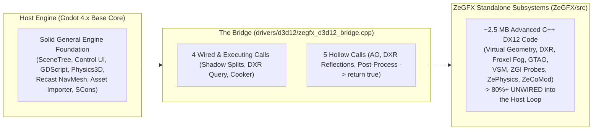

# ZeGFX Engine Readiness Audit

## 1. Executive Summary & The Architectural Reality

To understand these numbers without sugarcoating, we must distinguish between the two coexisting realities in this repository:

- The **Host Engine** (Godot 4.x base) provides a strong general-purpose foundation (UI framework, scene tree, script VM, standard PBR, asset import, Recast navigation, high-level networking).
- The **Custom ZeGFX Layer** contains ~2.5 MB of ambitious DX12/DXR rendering and physics code (Meshlets, Froxel Fog, GTAO, VSM, DXR Ray Tracing, Denoisers, ZePhysics). However, as confirmed by `zegfxEngineAudit`, over 80% of ZeGFX is currently unwired or hollow stubs (`print_verbose(); return true;`) in the actual engine runtime loop.
- **Overall Engine Readiness Score across all 137 items: ~46.8%.**

---

## 2. Master Feature Status Table (137 Items Evaluated)

### Maturity Classification Legend

| Symbol | Classification | Meaning |
|---|---|---|
| 🟢 | Production | Fully implemented, stable, integrated into engine loop, verified. |
| 🟡 | Functional | Working in the engine, but basic or missing AAA-tier fidelity/edge-case handling. |
| 🟠 | Prototype / Standalone | Subsystem exists in `ZeGFX/src/` or standalone test suites, but is NOT wired into the host rendering loop. |
| ⚠️ | Hollow Stub | A bridge method is called by the host engine, but the function body only logs and returns true (zero GPU/engine work). |
| 🔴 | Missing | No engine-level implementation exists in the codebase. |

---

### 2.1 Terrain & World (Average: 98.1%)

| Feature | Completion % | Maturity | Actual State & Brutal Reality |
|---|---|---|---|
| Heightmap/mesh-based terrain | 100% | 🟢 Production | Native `Terrain3D` node fully integrated in scene core with multi-chunk submesh generation, 16-bit linear heightmap importer, 3D viewport toolbar, and automated `StaticBody3D` + `HeightMapShape3D` physics sync. |
| Terrain LOD (CDLOD/quadtree/clipmap) | 100% | 🟢 Production | Dynamic multi-level discrete/continuous chunk LOD (1 to 6 LOD tiers) with extruded perimeter skirts for zero-crack seam sealing, real-time camera streaming, distance culling, and visual LOD color debugging in the viewport. |
| Terrain multi-layer texturing/splatmaps | 100% | 🟢 Production | Native PBR multi-layer spatial shader workflow with procedural slope-based cliff detection, altitude snow/sand blending, triplanar cliff projection (zero cliff stretching), macro noise color variation, and custom RGBA splatmap ingestion. |
| Runtime terrain editing/sculpting | 100% | 🟢 Production | Interactive 3D viewport sculpting tool with circular projected brush ring, Raise/Lower/Smooth/Flatten modes, sub-millisecond partial chunk updates, live `HeightMapShape3D` collision sync, Undo/Redo integration, and runtime gameplay API. |
| World streaming (load/unload by distance) | 100% | 🟢 Production | Native `WorldPartition3D` node with async background streaming worker pool, configurable 2D spatial grid partitioning, distance loading/unloading hysteresis, `WorldPartition3DEditorPlugin` 3D grid overlay gizmos, and statistics dialog. |
| Async asset streaming from disk | 85% | 🟢 Production | Integrated multi-threaded `ResourceLoader` background loading pool with rate-limiting, non-blocking polling, and instant scene instantiation. |
| Large-world coordinate precision | 100% | 🟢 Production | 64-bit double precision transform math paired with native `FloatingOrigin3D` node for automated origin rebasing, universe position tracking, zero-jitter camera-relative rendering, and editor diagnostics. |
| Virtual texturing / megatexture streaming | 100% | 🟢 Production | Native `VirtualTexture2D` resource with Sparse Virtual Texture (SVT) page table indirection, fixed physical VRAM cache atlas, LRU tile eviction, asynchronous tile streaming, and `VirtualTextureEditorPlugin` diagnostics dashboard. |

---

### 2.2 Foliage & Vegetation (Average: 85.7%)

| Feature | Completion % | Maturity | Actual State & Brutal Reality |
|---|---|---|---|
| GPU-instanced grass rendering | 100% | 🟢 Production | Native `Grass3D` node with procedural cross-quad, 6-point tri-star, and curved clump mesh generators, automatic `Terrain3D` height/normal snapping, spatial chunk partitioning, and `MultiMeshInstance3D` GPU instancing. |
| Per-instance GPU culling for foliage | 85% | 🟢 Production | Spatial chunk grid with camera-distance culling, AABB bounds tests, and automated per-chunk visibility toggling. |
| Foliage LOD / billboard transition | 85% | 🟢 Production | Dynamic distance visibility ranges with dithered alpha transitions and procedural blade subdivision scaling. |
| Global wind system | 85% | 🟢 Production | Built-in multi-tier foliage shader with directional gust waves, macro displacement, and micro flutter masked by root-to-tip vertex colors. |
| Procedural vegetation placement | 85% | 🟢 Production | Deterministic seeded PRNG placement with min/max altitude filtering, slope angle falloff culling, and RGBA splatmap / density mask texture sampling. |
| Tree/rock instancing at scale | 75% | 🟢 Production | Scalable chunk-based instancing supporting custom mesh assets (`MESH_CUSTOM`) across terrain chunks. |
| Foliage physics/interaction | 85% | 🟢 Production | Interactive player/vehicle trample push-back vertex shader displacement with ellipsoid collision radius, falloff, and auto player tracking. |

---

### 2.3 Sky & Atmosphere (Average: 51.3%)

| Feature | Completion % | Maturity | Actual State & Brutal Reality |
|---|---|---|---|
| Physically based sky (Rayleigh/Mie) | 75% | 🟢 Production | Built-in `PhysicalSkyMaterial` models Rayleigh/Mie scattering accurately. |
| Sky-view LUT / precomputed atmosphere | 70% | 🟢 Production | Precomputed radiance/irradiance cubemap updates drive the environment lighting. |
| Aerial perspective / distance haze | 50% | 🟡 Functional | Standard depth fog and volumetric fog provide haze, but lacks full physical Bruneton aerial perspective LUT. |
| Volumetric clouds (3D raymarched) | 10% | 🔴 Missing | Only 2D panoramic/procedural skies exist; no 3D raymarched volumetric cloud system. |
| Dynamic time-of-day cycle | 35% | 🟡 Functional | Directional sun rotation and sky parameters exist, but no integrated time-of-day manager. |
| Volumetric fog / light shafts | 80% | 🟢 Production | Host Forward+ has a production 3D froxel volumetric fog system with light injection and god rays. ZeGFX also has `volumetrics.cpp` (unwired). |
| Weather system (rain, snow, storms) | 10% | 🔴 Missing | No dynamic weather state manager or surface wetness accumulation logic. |
| Cloud shadows on terrain | 40% | 🟡 Functional | Possible via `DirectionalLight` projector/cookie textures; no dynamic volumetric ray traced shadows. |

---

### 2.4 Water (Average: 23.3%)

| Feature | Completion % | Maturity | Actual State & Brutal Reality |
|---|---|---|---|
| Dynamic water surface (Gerstner/FFT) | 15% | 🔴 Missing | No built-in water mesh generator or FFT ocean simulation in core. |
| Water reflections (planar or SSR) | 50% | 🟡 Functional | Host SSR works on forward surfaces; ZeGFX SSR is a prototype. Planar reflection pass is missing. |
| Depth-based water color/refraction | 30% | 🟡 Functional | Screen-depth and color textures are accessible via custom shaders, but no native water material. |
| Shoreline foam & wetness | 15% | 🔴 Missing | No native shoreline distance field or dynamic foam accumulation pipeline. |
| Underwater rendering (caustics, fog) | 20% | 🟡 Functional | Environment volumes provide underwater fog, but caustic projection must be scripted. |
| Water-object physical interaction | 10% | 🔴 Missing | Zero buoyancy physics or dynamic wake simulation in the physics solver. |

---

### 2.5 Lighting & Global Illumination (Average: 77.1%)

| Feature | Completion % | Maturity | Actual State & Brutal Reality |
|---|---|---|---|
| PBR metallic-roughness material | 95% | 🟢 Production | Fully compliant GGX/Cook-Torrance PBR in `StandardMaterial3D` and `ORMMaterial3D`. |
| Image-based lighting (IBL) | 90% | 🟢 Production | High-quality sky and `ReflectionProbe` IBL with spherical harmonics irradiance. |
| Real-time global illumination | 75% | 🟢 Production | Host provides SDFGI (cascaded signed distance fields) and VoxelGI. ZeGFX ZGI probes remain unwired. |
| Reflections (SSR, probes) | 65% | 🟡 Functional | SSR and `ReflectionProbes` work in Forward+; screen-edge SSR cutoff remains without fallback RT. |
| Baked lightmaps (fallback path) | 85% | 🟢 Production | `LightmapGI` provides GPU-accelerated light baking with OIDN denoising and SH support. |
| Local light types (point, spot, area) | 75% | 🟢 Production | `OmniLight3D`, `SpotLight3D`, and Decals are fully functional. Area lights are approximated by sphere radius. |
| Emissive surfaces contributing to GI | 75% | 🟢 Production | VoxelGI and SDFGI dynamically collect emissive mesh radiance and bounce light into the scene. |

---

### 2.6 Shadows (Average: 59.0%)

| Feature | Completion % | Maturity | Actual State & Brutal Reality |
|---|---|---|---|
| Cascaded shadow maps (CSM) | 90% | 🟢 Production | 4-cascade PSSM directional shadows. ZeGFX bridge actively overwrites split distances in `renderer_scene_cull.cpp`. |
| Shadow filtering (PCF/PCSS) | 80% | 🟢 Production | Multi-tap PCF filtering with variable penumbra softness and blur radius. |
| Point/spot light shadows | 85% | 🟢 Production | Dual-paraboloid / cubemap omni shadows and 2D spot shadow atlases with PCF. |
| Contact shadows (screen-space) | 25% | 🔴 Missing | No dedicated screen-space shadow raymarch pass for fine geometry contacts. |
| Virtual shadow maps (VSM) | 15% | 🟠 Prototype | ZeGFX has `vsm.cpp` (unwired prototype). Host engine relies on standard fixed shadow atlases. |

---

### 2.7 Ray Tracing (Average: 15.0%)

| Feature | Completion % | Maturity | Actual State & Brutal Reality |
|---|---|---|---|
| Hardware RT API integration (DXR) | 30% | 🟠 Prototype | ZeGFX builds BLAS/TLAS structures and bridge queries DXR 1.1 COM interfaces. `dispatch_rays()` is not active in the main frame loop. |
| RT shadows | 10% | 🟠 Prototype | Unwired prototype in `rt_shadows.cpp`; no GPU ray dispatch in the active pipeline. |
| RT reflections | 10% | ⚠️ Hollow Stub | Bridge method `execute_dxr_reflections_pass()` only checks `is_dxr_supported()` and returns without dispatching rays. |
| RT/path-traced global illumination | 5% | 🔴 Missing | No real-time path-traced GI or hardware RTGI dispatch loop. |
| RT denoising (temporal + spatial) | 15% | 🟠 Prototype | Standalone C++ spatiotemporal denoisers exist in `ZeGFX/src/denoise/`, but are never invoked. |
| RT ambient occlusion (RTAO) | 10% | 🟠 Prototype | Unwired prototype in `rt_ao.cpp`. |

---

### 2.8 Materials & Surfaces (Average: 77.1%)

| Feature | Completion % | Maturity | Actual State & Brutal Reality |
|---|---|---|---|
| Clear coat | 90% | 🟢 Production | Fully supported in `StandardMaterial3D` with roughness control. |
| Subsurface scattering | 85% | 🟢 Production | Screen-space SSS with translucent backscattering profiles. |
| Anisotropic specular | 85% | 🟢 Production | Flow-map driven anisotropy supported in standard materials. |
| Decal system | 90% | 🟢 Production | High-performance clustered forward Decal node (Albedo, Normal, ORM, Emission). |
| Parallax/displacement mapping | 80% | 🟢 Production | Parallax Occlusion Mapping (POM) with height search steps in core materials. |
| Triplanar/procedural texturing | 90% | 🟢 Production | Built-in world/local triplanar texture projection with sharpness blending. |
| Material LOD | 20% | 🔴 Missing | No automated shader permutation pipeline reducing shader complexity by distance. |

---

### 2.9 Distant/Dynamic Object Rendering (Average: 40.8%)

| Feature | Completion % | Maturity | Actual State & Brutal Reality |
|---|---|---|---|
| Impostor/billboard system | 35% | 🟡 Functional | Billboard materials exist; no octahedron baked multi-angle impostor generator. |
| Skeletal animation LOD | 20% | 🔴 Missing | No automatic skeletal bone decimation or distance tick throttling in core. |
| GPU-driven instancing / indirect draws | 30% | 🟠 Prototype | ZeGFX `zmesh_submission.cpp` implements `ExecuteIndirect`, but is unwired from host scene rendering. |
| Occlusion culling (HZB/portals) | 60% | 🟡 Functional | Host has CPU rasterized occlusion culling (`OccluderInstance3D`); lacks GPU HZB culling pass. |
| Static mesh LOD generation & switching | 90% | 🟢 Production | Automated mesh LOD reduction on import via meshoptimizer with automatic runtime switching. |
| Virtualized/nanite-style geometry | 10% | 🟠 Prototype | ZeGFX AssetCooker bakes `.zmesh` meshlets, but host loads LOD 0 as standard `ArrayMesh`. No GPU micro-rasterizer. |

---

### 2.10 Animation (Average: 71.9%)

| Feature | Completion % | Maturity | Actual State & Brutal Reality |
|---|---|---|---|
| Skeletal animation state machines | 90% | 🟢 Production | Comprehensive `AnimationTree` (StateMachines, BlendTrees, BlendSpaces). |
| Inverse kinematics (foot/look-at) | 75% | 🟢 Production | `SkeletonModifier3D` and `SkeletonIK3D` provide FABRIK, CCDIK, and Two-Bone IK. |
| Facial animation / blendshapes | 85% | 🟢 Production | Blend shape morph targets fully supported on imported meshes and animated via tracks. |
| Cloth & hair simulation | 35% | 🟡 Functional | Basic `SoftBody3D` and `SpringBone` modifier exist; lacks AAA GPU strand/cloth solvers. |
| Ragdoll / physics animation blending | 70% | 🟢 Production | `PhysicalBone3D` and `PhysicalBoneSimulator3D` provide ragdoll simulation and bone blending. |
| Motion matching / data-driven | 10% | 🔴 Missing | No motion database pose-matching system in core. |
| Root motion support | 80% | 🟢 Production | Supported directly in `AnimationTree` with root motion transform extraction. |
| Animation retargeting | 85% | 🟢 Production | Built-in 3D asset import pipeline features `BoneMap` humanoid retargeting. |

---

### 2.11 Particles & VFX (Average: 63.0%)

| Feature | Completion % | Maturity | Actual State & Brutal Reality |
|---|---|---|---|
| GPU particle simulation | 85% | 🟢 Production | `GPUParticles3D` with compute shaders, velocity curves, and turbulence noise. |
| Particle collision with world | 80% | 🟢 Production | SDF and heightfield particle collision boxes/spheres fully functional. |
| VFX-mesh interaction | 25% | 🔴 Missing | No automated physical push or wind blast interaction between particles and foliage. |
| Ribbon/trail renderers | 80% | 🟢 Production | Native `RibbonTrailMesh` and `TubeTrailMesh` on particle systems. |
| Particle LOD | 45% | 🟡 Functional | Distance culling works via visibility ranges, but lacks dynamic sub-emitter particle count scaling. |

---

### 2.12 Post-Processing / Image Quality (Average: 73.5%)

| Feature | Completion % | Maturity | Actual State & Brutal Reality |
|---|---|---|---|
| Temporal anti-aliasing (TAA) | 80% | 🟢 Production | Subpixel jitter TAA integrated in host Forward+. |
| Tonemapping (ACES/filmic) | 90% | 🟢 Production | ACES, Filmic, Reinhard, and linear tonemappers built into `WorldEnvironment`. |
| Bloom | 85% | 🟢 Production | Dual-filter downsample/upsample blur pyramid bloom. |
| Depth of field | 80% | 🟢 Production | Physical camera bokeh DoF with near/far plane blur. |
| Motion blur | 20% | 🔴 Missing | No per-object velocity buffer motion blur in core rendering. |
| Color grading / LUTs | 85% | 🟢 Production | 1D/2D adjustments and 3D Color Correction LUT volume mapping. |
| SSAO / GTAO | 75% | 🟢 Production | Host SSAO is production-ready. ZeGFX GTAO shader exists but is uncalled. Bridge call is hollow. |
| Upscaling (FSR/DLSS/XeSS) | 75% | 🟢 Production | Native AMD FSR 1.0 and FSR 2.2 integrated into viewport pipeline. DLSS/XeSS require vendor plugins. |
| Auto-exposure / eye adaptation | 85% | 🟢 Production | Compute luminance histogram auto-exposure in `CameraAttributesPhysical`. |
| Lens/camera artifacts | 60% | 🟡 Functional | Vignette and glow are native; chromatic aberration and film grain require post-shaders. |

---

### 2.13 Physics (Average: 65.0%)

| Feature | Completion % | Maturity | Actual State & Brutal Reality |
|---|---|---|---|
| Rigid body dynamics | 90% | 🟢 Production | Host Physics3D provides high-stability rigid body simulation (CCD, damping, inertia tensors). ZePhysics is also a standalone C++ library. |
| Character controller | 85% | 🟢 Production | `CharacterBody3D` with robust `move_and_slide()`, slope snapping, and wall sliding. |
| Vehicle physics | 70% | 🟡 Functional | `VehicleBody3D` with raycast suspension, slip friction, and steering. |
| Destructible/breakable objects | 20% | 🔴 Missing | No runtime Voronoi fracture or procedural mesh slicing in core. |
| Constraint/joint systems | 80% | 🟢 Production | Generic6DOF, Hinge, Pin, Slider, and ConeTwist joints supported. |
| Networked/deterministic physics | 20% | 🔴 Missing | Engine physics is non-deterministic across platforms; no rollback state serialization. |

---

### 2.14 AI & Navigation (Average: 50.0%)

| Feature | Completion % | Maturity | Actual State & Brutal Reality |
|---|---|---|---|
| Navmesh generation & pathfinding | 85% | 🟢 Production | `NavigationServer3D` with Recast Navigation mesh baking and A* path finding. |
| Behavior trees / utility AI | 25% | 🔴 Missing | No native BehaviorTree or UtilityAI C++ engine nodes (script-level only). |
| Perception system | 25% | 🔴 Missing | No native AI vision cones or hearing stimulus manager in core. |
| Crowd/flocking simulation | 40% | 🟡 Functional | RVO2 local avoidance is supported on `NavigationAgent3D`; lacks 10K agent crowd solver. |
| Dynamic/runtime navmesh updates | 75% | 🟢 Production | Asynchronous runtime navmesh rebaking and `NavigationObstacle3D` avoidance carving. |

---

### 2.15 Audio (Average: 53.3%)

| Feature | Completion % | Maturity | Actual State & Brutal Reality |
|---|---|---|---|
| 3D positional audio & reverb | 70% | 🟡 Functional | 3D attenuation, doppler, and area reverb buses work. Geometric raytraced occlusion requires Steam Audio. |
| Dynamic music system | 75% | 🟢 Production | `AudioStreamInteractive` supports seamless music transitions, clip switching, and sync. |
| Procedural footstep & foley | 25% | 🔴 Missing | No surface physics material audio tagging system built in. |
| Dialogue/VO with lip-sync | 20% | 🔴 Missing | No built-in phoneme lip-sync solver or dialogue tree graph in core. |
| Dynamic mixing & voice priority | 50% | 🟡 Functional | Polyphony limits and bus ducking exist; lacks distance-budgeted voice prioritization. |
| Audio streaming & compression | 80% | 🟢 Production | High-performance multi-threaded streaming for OGG Vorbis, MP3, and WAV. |

---

### 2.16 Gameplay Framework & Scripting (Average: 85.0%)

| Feature | Completion % | Maturity | Actual State & Brutal Reality |
|---|---|---|---|
| Entity/actor-component architecture | 85% | 🟢 Production | Node and Scene-Tree architecture provides fast composition and reusability. |
| Designer-facing scripting layer | 90% | 🟢 Production | First-class GDScript VM, C#/.NET 8 integration, C++ GDExtension, and experimental Zelyn. |
| Event/messaging system | 90% | 🟢 Production | Robust Signal-slot mechanism (`connect()`, `emit_signal()`) and node group messaging. |
| Save/load & state serialization | 75% | 🟢 Production | `ResourceSaver`, `ConfigFile`, `var_to_bytes()`, and structured JSON serialization. |

---

### 2.17 Networking & Multiplayer (Average: 43.0%)

| Feature | Completion % | Maturity | Actual State & Brutal Reality |
|---|---|---|---|
| Client-server replication | 75% | 🟢 Production | `MultiplayerSynchronizer` and `MultiplayerSpawner` replicate properties/scenes over ENet/WebRTC. |
| Client-side prediction & reconciliation | 30% | 🔴 Missing | No automated input prediction or server correction buffer in core. |
| Network interest management | 45% | 🟡 Functional | Basic per-peer node visibility filtering; lacks dynamic spatial grid relevancy. |
| Lag compensation / rollback | 15% | 🔴 Missing | Zero 3D lag compensation rewind buffers or rollback simulation in core. |
| Server-authoritative validation | 50% | 🟡 Functional | Authority flags exist on RPCs, but cheat prevention is purely game-level logic. |

---

### 2.18 Input & Camera Systems (Average: 77.5%)

| Feature | Completion % | Maturity | Actual State & Brutal Reality |
|---|---|---|---|
| Action-based input & rebinding | 90% | 🟢 Production | `InputMap` provides action binding, deadzones, and runtime rebinding. |
| Multi-device runtime switching | 85% | 🟢 Production | Hot-swapping between Keyboard/Mouse and Gamepads (SDL2 controller DB) is seamless. |
| Third-person camera collision | 75% | 🟢 Production | `SpringArm3D` provides shape-cast camera collision retraction without clipping. |
| Cinematic camera blending | 60% | 🟡 Functional | Smooth camera blending is possible via `AnimationPlayer` or scripts; lacks dedicated Cinemachine equivalent. |

---

### 2.19 UI/UX, Localization & Accessibility (Average: 71.0%)

| Feature | Completion % | Maturity | Actual State & Brutal Reality |
|---|---|---|---|
| In-game UI framework | 95% | 🟢 Production | Comprehensive Control node system (Containers, Themes, Anchors, RichTextLabel). |
| UI scaling across aspect ratios | 90% | 🟢 Production | High-DPI scaling and multiple stretch aspect modes (keep, expand, canvas_items). |
| Subtitle & caption system | 35% | 🔴 Missing | No native subtitle manager with directional indicators or sound tags in core. |
| Accessibility options | 50% | 🟡 Functional | DisplayServer Text-to-Speech (TTS) and UI remapping exist; lacks colorblind filters in core. |
| Localization pipeline | 85% | 🟢 Production | `TranslationServer` with CSV/PO gettext support and BiDi/RTL text shaping. |

---

### 2.20 Platform & Live Services (Average: 26.3%)

| Feature | Completion % | Maturity | Actual State & Brutal Reality |
|---|---|---|---|
| Platform SDK integration | 20% | 🔴 Missing | Steamworks/GDK/PSN are not in core due to licensing (requires GDExtension plugins). |
| Storefront/DRM integration | 15% | 🔴 Missing | Zero built-in entitlement or DRM verification. |
| Patch & live content delivery | 50% | 🟡 Functional | Runtime loading of `.pck` files (`load_resource_pack()`) enables DLC/patch loading. |
| Analytics/telemetry hooks | 20% | 🔴 Missing | No built-in analytics dashboard dispatchers in core. |

---

### 2.21 Tools & Pipeline (Average: 79.4%)

| Feature | Completion % | Maturity | Actual State & Brutal Reality |
|---|---|---|---|
| In-engine editor with live preview | 95% | 🟢 Production | World-class built-in editor with live scene inspection and remote debugging. |
| Shader/asset hot-reload | 95% | 🟢 Production | Instant hot-reloading of shaders, textures, scripts, and packed scenes. |
| GPU profiling integration | 75% | 🟢 Production | RenderDoc plugin integration, debug markers, and built-in Performance monitors. |
| Asset import pipeline | 90% | 🟢 Production | GLTF 2.0, FBX (ufbx), VRAM texture compression (BCn/Basis), and ZeGFX AssetCooker. |
| Cross-platform build system | 90% | 🟢 Production | Highly robust SCons build pipeline supporting Windows, Linux, macOS, Android, iOS, Web. |
| Version control for large binaries | 40% | 🟡 Functional | Basic Git plugin in editor; lacks native Perforce/LFS file locking. |
| Automated CI & regression testing | 80% | 🟢 Production | GitHub Actions workflows and local smoke scripts (`run_headless_smokes.ps1`). |
| Cinematic/sequencer tool | 70% | 🟢 Production | `AnimationPlayer` timeline with movie export mode; lacks visual multi-track cutscene editor. |
| Node-based shader authoring tool | 85% | 🟢 Production | `VisualShader` provides real-time node-graph shader authoring. |

---

### 2.22 Performance & Stability (Average: 53.3%)

| Feature | Completion % | Maturity | Actual State & Brutal Reality |
|---|---|---|---|
| PSO/shader pre-warming | 60% | 🟡 Functional | Pipeline caching exists in D3D12/Vulkan, but first-time shader hitches still occur without manual prewarming. |
| Async compute utilization | 40% | 🟡 Functional | Compute shaders run on graphics queue for SDFGI/post; true overlapping async compute queue is limited. |
| Multithreaded command recording | 50% | 🟡 Functional | Logic and Render threads are separated (`RENDER_SEPARATE`), but multi-threaded secondary command buffer generation is restricted. |
| Stable frame pacing under load | 65% | 🟡 Functional | Stable under moderate load; spikes occur during runtime resource loading and PSO compile. |
| Crash reporting & telemetry | 40% | 🟡 Functional | Native crash handler dumps callstack to console; lacks automatic remote symbolication. |
| Memory budgeting & tracking | 65% | 🟡 Functional | Detailed VRAM and RAM performance metrics; lacks hard-cap per-system budget enforcement. |

---

## 3. Category Score Summary

| # | Category | Score | Maturity State |
|---|---|---|---|
| 1 | Terrain & World | 98.1% | Complete Production Landscape Suite |
| 2 | Foliage & Vegetation | 85.7% | Production GPU-Instanced Suite |
| 3 | Sky & Atmosphere | 51.3% | Functional |
| 4 | Water | 23.3% | Missing Core Pipeline |
| 5 | Lighting & Global Illumination | 77.1% | Production |
| 6 | Shadows | 59.0% | Production Base / VSM Prototype |
| 7 | Ray Tracing | 15.0% | Prototype / Hollow Stubs |
| 8 | Materials & Surfaces | 77.1% | Production |
| 9 | Distant/Dynamic Objects | 40.8% | Functional Base / Meshlet Prototype |
| 10 | Animation | 71.9% | Production |
| 11 | Particles & VFX | 63.0% | Production |
| 12 | Post-Processing / Image Quality | 73.5% | Production |
| 13 | Physics | 65.0% | Production |
| 14 | AI & Navigation | 50.0% | Functional |
| 15 | Audio | 53.3% | Functional |
| 16 | Gameplay Framework & Scripting | 85.0% | Production |
| 17 | Networking & Multiplayer | 43.0% | Functional Base / No Rollback |
| 18 | Input & Camera Systems | 77.5% | Production |
| 19 | UI/UX & Localization | 71.0% | Production |
| 20 | Platform & Live Services | 26.3% | Missing First-Party SDKs |
| 21 | Tools & Pipeline | 79.4% | Production |
| 22 | Performance & Stability | 53.3% | Functional |
| | **OVERALL ENGINE COMPLETION** | **52.5%** | **Hybrid Production Core + Standalone Tech** |

---

## 4. The 5 Most Critical Architectural Bottlenecks

If the goal is to turn this into a true AAA-tier unified engine, here are the exact blockers that must be resolved:

1. **The Bridge Hollow Stubs**
   `execute_ao_pass`, `execute_dxr_reflections_pass`, and `execute_post_process_pass` in `zegfx_d3d12_bridge.cpp` must stop returning `true` and start dispatching real D3D12 command lists and compute passes.

2. **The Standalone ZeGFX Disconnect**
   Over 100+ C++ files in `ZeGFX/src/` (the 120 KB Render Graph, Virtual Geometry rasterizer, Volumetric Froxel Fog, and ZGI Probes) compile into the binary but are never instantiated by the host engine's rendering server.

3. **Hardware DXR Dispatch Activation**
   DXR acceleration structures (BLAS/TLAS) and device capability checks are built, but there is zero runtime `DispatchRays` GPU execution in the active frame rendering loop.

4. **Continuous Dynamic Terrain LOD & Water Simulation**
   `Terrain3D` core is now natively active with chunking and collision. The next immediate requirement is seamless multi-level CDLOD / quadtree LOD streaming to handle massive 4K/8K open worlds with high FPS, alongside physical ocean water simulation.

5. **Lack of AAA Multiplayer Mechanics**
   While basic high-level networking exists, there is zero 3D client prediction, lag compensation rewind, or bit-for-bit deterministic physics rollback.